# GPU Rental Platform - Architecture Specification (C4 Model with Mermaid)

## Document Information

- **Version**: 1.0.0
- **Last Updated**: 2025-10-30
- **Status**: Draft
- **Architecture Model**: C4 (Context, Containers, Components, Code)

---

## Executive Summary

본 플랫폼은 블록체인 기반 탈중앙화 GPU 대여 시스템으로, 스마트 컨트랙트를 통한 중개와 IPFS를 통한 Docker 이미지 배포를 핵심으로 합니다.

**핵심 가치:**

- 온체인 중개로 투명한 거래
- IPFS로 검열 저항성 있는 이미지 배포
- P2P 기반 비용 효율적 대역폭 활용
- 토큰 이코노미를 통한 생태계 활성화

---

# Level 1: System Context Diagram

## 1.1 Context Overview

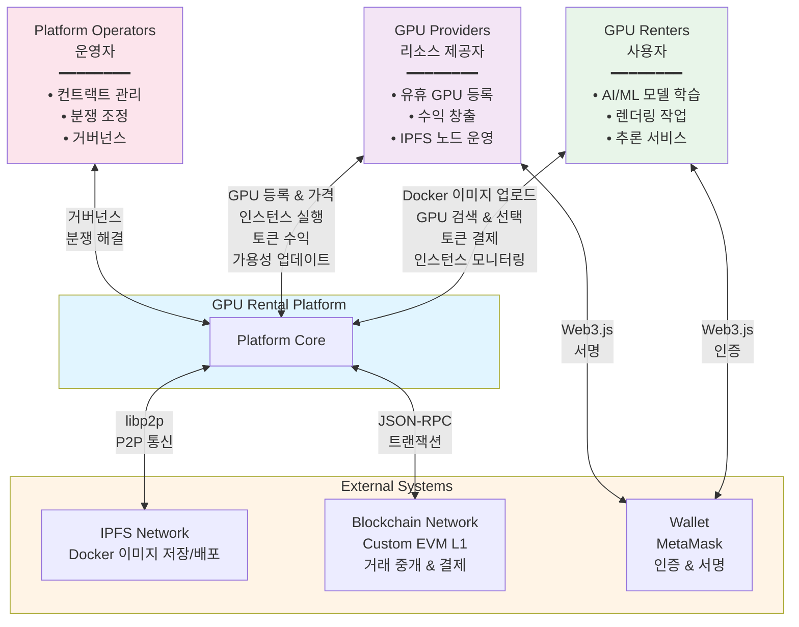
```mermaid
graph TB
    subgraph External["External Systems"]
        IPFS[IPFS Network<br/>Docker 이미지 저장/배포]
        BC[Blockchain Network<br/>Custom EVM L1<br/>거래 중개 & 결제]
        Wallet[Wallet<br/>MetaMask<br/>인증 & 서명]
    end
    
    subgraph Platform["GPU Rental Platform<br/>Blockchain + IPFS"]
        Core[Platform Core]
    end
    
    Renter[GPU Renters<br/>사용자<br/>━━━━━━━━<br/>• AI/ML 모델 학습<br/>• 렌더링 작업<br/>• 추론 서비스]
    Provider[GPU Providers<br/>리소스 제공자<br/>━━━━━━━━<br/>• 유휴 GPU 등록<br/>• 수익 창출<br/>• IPFS 노드 운영]
    Operator[Platform Operators<br/>운영자<br/>━━━━━━━━<br/>• 컨트랙트 관리<br/>• 분쟁 조정<br/>• 거버넌스]
    
    Renter <-->|Docker 이미지 업로드<br/>GPU 검색 & 선택<br/>토큰 결제<br/>인스턴스 모니터링| Core
    Provider <-->|GPU 등록 & 가격<br/>인스턴스 실행<br/>토큰 수익<br/>가용성 업데이트| Core
    Operator <-->|거버넌스<br/>분쟁 해결| Core
    
    Core <-->|libp2p<br/>P2P 통신| IPFS
    Core <-->|JSON-RPC<br/>트랜잭션| BC
    Renter <-->|Web3.js<br/>인증| Wallet
    Provider <-->|Web3.js<br/>서명| Wallet
    
    style Platform fill:#e1f5ff
    style External fill:#fff4e6
    style Renter fill:#e8f5e9
    style Provider fill:#f3e5f5
    style Operator fill:#fce4ec
```

## 1.2 Actors & Responsibilities

### GPU Renters (사용자)

**역할**: GPU 리소스를 빌려서 AI/ML 워크로드 실행

**주요 활동**:
- Docker 이미지를 IPFS에 업로드
- GPU 인스턴스 검색 및 선택
- 토큰으로 대여 비용 지불
- 인스턴스 실행 및 모니터링

**예시**:
- AI 연구자가 모델 학습
- 개발자가 렌더링 작업
- 스타트업이 추론 서비스 운영

### GPU Providers (리소스 제공자)

**역할**: 유휴 GPU 리소스를 플랫폼에 등록하여 수익 창출

**주요 활동**:
- GPU 리소스 등록 (스펙, 가격)
- IPFS 노드 운영 (이미지 캐싱)
- 사용자 인스턴스 실행
- 토큰으로 수익 수취

**예시**:
- 마이닝 업체의 유휴 GPU
- 개인 게이머의 고성능 PC
- 데이터센터의 잉여 리소스

### Platform Operators (운영자)

**역할**: 플랫폼 인프라 유지 및 거버넌스

**주요 활동**:
- 스마트 컨트랙트 업그레이드
- 분쟁 조정
- 프로토콜 파라미터 조정

## 1.3 External Systems

### IPFS Network
- **목적**: Docker 이미지 저장 및 배포
- **통신 방식**: libp2p (P2P)
- **데이터**: Docker 이미지, 설정 파일

### Blockchain Network (Custom EVM L1)
- **목적**: 거래 중개, 결제, 평판 관리
- **통신 방식**: JSON-RPC
- **데이터**: 거래 내역, 리소스 메타데이터, 토큰

### Wallet (MetaMask)
- **목적**: 사용자 인증 및 트랜잭션 서명
- **통신 방식**: Web3.js / ethers.js
- **데이터**: 개인키, 서명

---

# Level 2: Container Diagram

## 2.1 High-Level Architecture

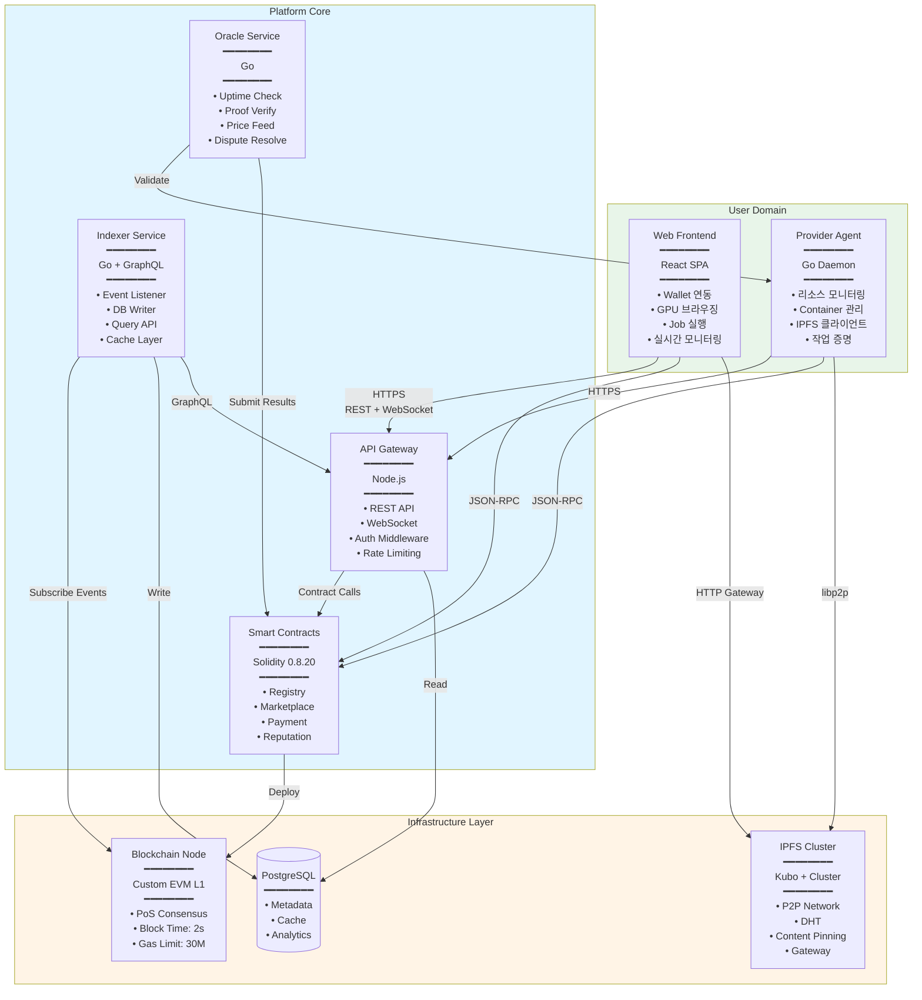
```mermaid
graph TB
    subgraph UserDomain["User Domain"]
        Frontend[Web Frontend<br/>━━━━━━━━<br/>React SPA<br/>━━━━━━━━<br/>• Wallet 연동<br/>• GPU 브라우징<br/>• Job 실행<br/>• 실시간 모니터링]
        
        ProviderAgent[Provider Agent<br/>━━━━━━━━<br/>Go Daemon<br/>━━━━━━━━<br/>• 리소스 모니터링<br/>• Container 관리<br/>• IPFS 클라이언트<br/>• 작업 증명]
    end
    
    subgraph PlatformCore["Platform Core"]
        API[API Gateway<br/>━━━━━━━━<br/>Node.js<br/>━━━━━━━━<br/>• REST API<br/>• WebSocket<br/>• Auth Middleware<br/>• Rate Limiting]
        
        SC[Smart Contracts<br/>━━━━━━━━<br/>Solidity 0.8.20<br/>━━━━━━━━<br/>• Registry<br/>• Marketplace<br/>• Payment<br/>• Reputation]
        
        Indexer[Indexer Service<br/>━━━━━━━━<br/>Go + GraphQL<br/>━━━━━━━━<br/>• Event Listener<br/>• DB Writer<br/>• Query API<br/>• Cache Layer]
        
        Oracle[Oracle Service<br/>━━━━━━━━<br/>Go<br/>━━━━━━━━<br/>• Uptime Check<br/>• Proof Verify<br/>• Price Feed<br/>• Dispute Resolve]
    end
    
    subgraph Infrastructure["Infrastructure Layer"]
        BCNode[Blockchain Node<br/>━━━━━━━━<br/>Custom EVM L1<br/>━━━━━━━━<br/>• PoS Consensus<br/>• Block Time: 2s<br/>• Gas Limit: 30M]
        
        IPFSCluster[IPFS Cluster<br/>━━━━━━━━<br/>Kubo + Cluster<br/>━━━━━━━━<br/>• P2P Network<br/>• DHT<br/>• Content Pinning<br/>• Gateway]
        
        DB[(PostgreSQL<br/>━━━━━━━━<br/>• Metadata<br/>• Cache<br/>• Analytics)]
    end
    
    Frontend -->|HTTPS<br/>REST + WebSocket| API
    Frontend -->|JSON-RPC| SC
    Frontend -->|HTTP Gateway| IPFSCluster
    
    ProviderAgent -->|HTTPS| API
    ProviderAgent -->|JSON-RPC| SC
    ProviderAgent -->|libp2p| IPFSCluster
    
    API -->|Contract Calls| SC
    API -->|Read| DB
    
    SC -->|Deploy| BCNode
    
    Indexer -->|Subscribe Events| BCNode
    Indexer -->|Write| DB
    Indexer -->|GraphQL| API
    
    Oracle -->|Validate| ProviderAgent
    Oracle -->|Submit Results| SC
    
    style UserDomain fill:#e8f5e9
    style PlatformCore fill:#e1f5ff
    style Infrastructure fill:#fff4e6
```

## 2.2 Container Descriptions

### Web Frontend (React SPA)

**Technology**: React 18, TypeScript, ethers.js, TailwindCSS

**Responsibilities**:
- 사용자 인터페이스 제공
- 지갑 연동 (MetaMask)
- 스마트 컨트랙트 상호작용
- IPFS 이미지 업로드/다운로드

**Communication**:
- API Gateway: HTTPS (REST + WebSocket)
- Blockchain: JSON-RPC
- IPFS: HTTP Gateway

**Key Features**:
```typescript
// 주요 화면 구성
- Dashboard: GPU 리스트, 내 인스턴스
- Marketplace: Provider 검색, 필터링
- Image Manager: IPFS 업로드/관리
- Instance Console: 실시간 모니터링
- Wallet: 잔액, 거래 내역
```

### Provider Agent (Go Daemon)

**Technology**: Go, Docker SDK, IPFS go-ipfs, libp2p

**Responsibilities**:
- GPU 리소스 모니터링
- Docker 컨테이너 관리
- IPFS 이미지 캐싱 및 제공
- 작업 증명 생성

**Communication**:
- API Gateway: HTTPS
- Blockchain: JSON-RPC
- IPFS: libp2p
- Docker: Unix Socket

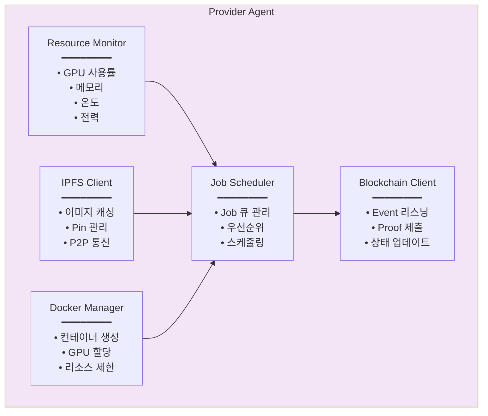
```mermaid
graph TB
    subgraph ProviderAgent["Provider Agent"]
        Monitor[Resource Monitor<br/>━━━━━━━━<br/>• GPU 사용률<br/>• 메모리<br/>• 온도<br/>• 전력]
        
        IPFSClient[IPFS Client<br/>━━━━━━━━<br/>• 이미지 캐싱<br/>• Pin 관리<br/>• P2P 통신]
        
        DockerMgr[Docker Manager<br/>━━━━━━━━<br/>• 컨테이너 생성<br/>• GPU 할당<br/>• 리소스 제한]
        
        Scheduler[Job Scheduler<br/>━━━━━━━━<br/>• Job 큐 관리<br/>• 우선순위<br/>• 스케줄링]
        
        BCClient[Blockchain Client<br/>━━━━━━━━<br/>• Event 리스닝<br/>• Proof 제출<br/>• 상태 업데이트]
        
        Monitor --> Scheduler
        IPFSClient --> Scheduler
        DockerMgr --> Scheduler
        Scheduler --> BCClient
    end
    
    style ProviderAgent fill:#f3e5f5
```

### API Gateway (Node.js)

**Technology**: Node.js, Express, Socket.io, Redis

**Responsibilities**:
- RESTful API 제공
- WebSocket 실시간 통신
- 인증/인가 (JWT, Wallet Signature)
- Rate Limiting

**Endpoints**:
```typescript
// REST API
GET    /api/v1/gpus              // GPU 리스트
GET    /api/v1/gpus/:id          // GPU 상세
POST   /api/v1/instances         // 인스턴스 생성
GET    /api/v1/instances/:id     // 인스턴스 상태
DELETE /api/v1/instances/:id     // 인스턴스 종료

GET    /api/v1/images            // 이미지 리스트
POST   /api/v1/images/upload     // 이미지 업로드 (IPFS)
GET    /api/v1/images/:cid       // 이미지 메타데이터

// WebSocket
ws://api/instances/:id/logs      // 실시간 로그
ws://api/instances/:id/metrics   // 실시간 메트릭
```

### Smart Contracts (Solidity)

**Technology**: Solidity 0.8.20, OpenZeppelin, Hardhat

**Core Contracts**:
1. **GPUToken.sol**: ERC20 토큰
2. **ResourceRegistry.sol**: GPU 리소스 등록
3. **Marketplace.sol**: 매칭 및 주문 관리
4. **PaymentEscrow.sol**: 에스크로 결제
5. **ReputationSystem.sol**: 평판 관리

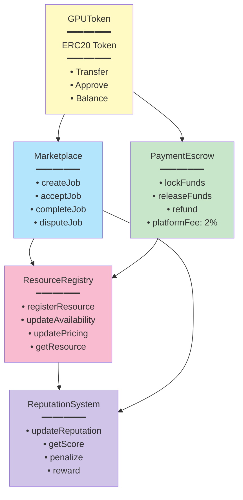
```mermaid
graph TD
    Token[GPUToken<br/>━━━━━━━━<br/>ERC20 Token<br/>━━━━━━━━<br/>• Transfer<br/>• Approve<br/>• Balance]
    
    Token --> Market[Marketplace<br/>━━━━━━━━<br/>• createJob<br/>• acceptJob<br/>• completeJob<br/>• disputeJob]
    
    Token --> Escrow[PaymentEscrow<br/>━━━━━━━━<br/>• lockFunds<br/>• releaseFunds<br/>• refund<br/>• platformFee: 2%]
    
    Market --> Registry[ResourceRegistry<br/>━━━━━━━━<br/>• registerResource<br/>• updateAvailability<br/>• updatePricing<br/>• getResource]
    
    Escrow --> Registry
    
    Registry --> Reputation[ReputationSystem<br/>━━━━━━━━<br/>• updateReputation<br/>• getScore<br/>• penalize<br/>• reward]
    
    Market --> Reputation
    
    style Token fill:#fff9c4
    style Market fill:#b3e5fc
    style Escrow fill:#c8e6c9
    style Registry fill:#f8bbd0
    style Reputation fill:#d1c4e9
```

### Indexer Service (Go)

**Technology**: Go, PostgreSQL, GraphQL

**Responsibilities**:
- 블록체인 이벤트 리스닝
- 데이터 인덱싱 및 캐싱
- GraphQL API 제공
- 복잡한 쿼리 지원

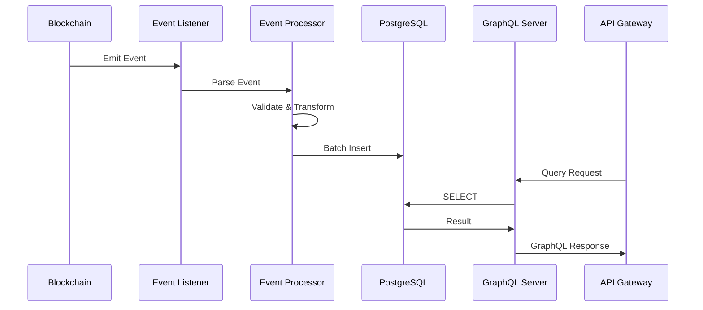
```mermaid
sequenceDiagram
    participant BC as Blockchain
    participant Listener as Event Listener
    participant Processor as Event Processor
    participant DB as PostgreSQL
    participant GQL as GraphQL Server
    participant Client as API Gateway
    
    BC->>Listener: Emit Event
    Listener->>Processor: Parse Event
    Processor->>Processor: Validate & Transform
    Processor->>DB: Batch Insert
    Client->>GQL: Query Request
    GQL->>DB: SELECT
    DB->>GQL: Result
    GQL->>Client: GraphQL Response
```

### Oracle Service (Go)

**Technology**: Go, Chainlink (optional)

**Responsibilities**:
- Provider 가용성 검증
- 작업 증명 검증
- 외부 데이터 피드 (GPU 가격)
- 분쟁 해결 데이터 제공

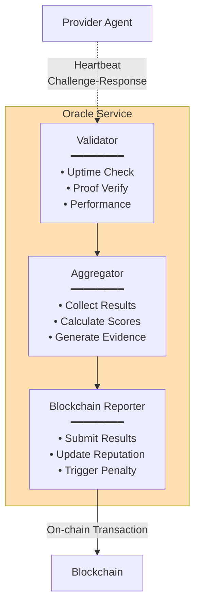
```mermaid
graph TB
    subgraph Oracle["Oracle Service"]
        Validator[Validator<br/>━━━━━━━━<br/>• Uptime Check<br/>• Proof Verify<br/>• Performance]
        
        Aggregator[Aggregator<br/>━━━━━━━━<br/>• Collect Results<br/>• Calculate Scores<br/>• Generate Evidence]
        
        Reporter[Blockchain Reporter<br/>━━━━━━━━<br/>• Submit Results<br/>• Update Reputation<br/>• Trigger Penalty]
        
        Validator --> Aggregator
        Aggregator --> Reporter
    end
    
    Provider[Provider Agent] -.->|Heartbeat<br/>Challenge-Response| Validator
    Reporter -->|On-chain Transaction| BC[Blockchain]
    
    style Oracle fill:#ffe0b2
```

### Blockchain Node (Custom EVM L1)

**Technology**: Geth (Go Ethereum) Fork

**Configuration**:
- Consensus: PoS (Proof of Stake)
- Block Time: 2초
- Gas Limit: 30M
- Native Token: GPU Token

### IPFS Cluster

**Technology**: IPFS Kubo, IPFS Cluster

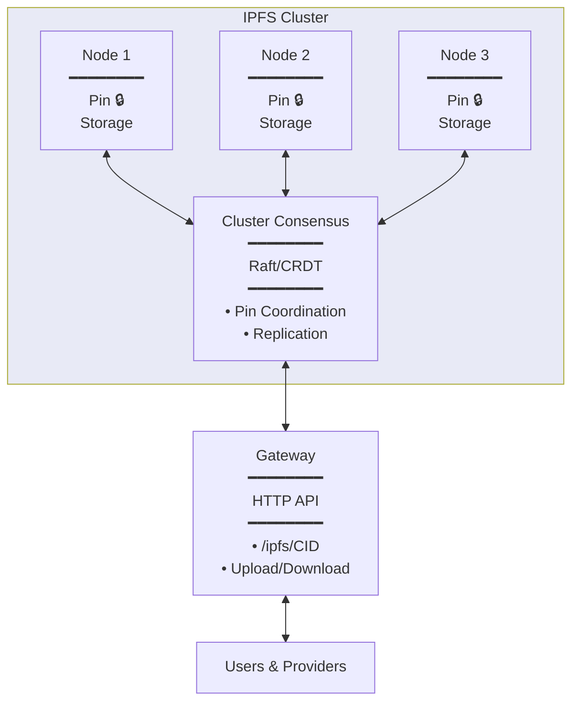
```mermaid
graph TB
    subgraph Cluster["IPFS Cluster"]
        N1[Node 1<br/>━━━━━━━━<br/>Pin 🔒<br/>Storage]
        N2[Node 2<br/>━━━━━━━━<br/>Pin 🔒<br/>Storage]
        N3[Node 3<br/>━━━━━━━━<br/>Pin 🔒<br/>Storage]
        
        Consensus[Cluster Consensus<br/>━━━━━━━━<br/>Raft/CRDT<br/>━━━━━━━━<br/>• Pin Coordination<br/>• Replication]
        
        N1 <--> Consensus
        N2 <--> Consensus
        N3 <--> Consensus
    end
    
    Gateway[Gateway<br/>━━━━━━━━<br/>HTTP API<br/>━━━━━━━━<br/>• /ipfs/CID<br/>• Upload/Download]
    
    Consensus <--> Gateway
    Gateway <--> Users[Users & Providers]
    
    style Cluster fill:#e8eaf6
```

### PostgreSQL

**Purpose**: Off-chain 데이터 저장

**Schema**:
```sql
-- 캐시된 GPU 정보
gpu_resources
  - id
  - provider_address
  - gpu_model
  - vcpu
  - memory_gb
  - price_per_hour
  - availability
  - reputation_score

-- 인스턴스 실행 히스토리
instance_history
  - id
  - instance_id (onchain)
  - user_address
  - provider_address
  - image_cid
  - start_time
  - end_time
  - total_cost

-- IPFS 이미지 메타데이터
images
  - cid
  - name
  - size
  - uploader
  - download_count
  - created_at
```

---

# Level 3: Component Diagram

## 3.1 Smart Contract Components

### 3.1.1 ResourceRegistry Contract

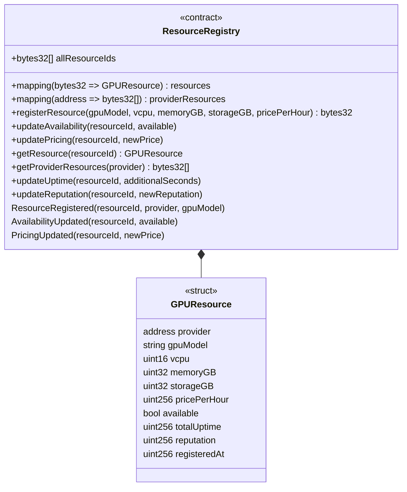
```mermaid
classDiagram
    class ResourceRegistry {
        <<contract>>
        +mapping(bytes32 => GPUResource) resources
        +mapping(address => bytes32[]) providerResources
        +bytes32[] allResourceIds
        
        +registerResource(gpuModel, vcpu, memoryGB, storageGB, pricePerHour) bytes32
        +updateAvailability(resourceId, available)
        +updatePricing(resourceId, newPrice)
        +getResource(resourceId) GPUResource
        +getProviderResources(provider) bytes32[]
        +updateUptime(resourceId, additionalSeconds)
        +updateReputation(resourceId, newReputation)
        
        <<events>>
        ResourceRegistered(resourceId, provider, gpuModel)
        AvailabilityUpdated(resourceId, available)
        PricingUpdated(resourceId, newPrice)
    }
    
    class GPUResource {
        <<struct>>
        address provider
        string gpuModel
        uint16 vcpu
        uint32 memoryGB
        uint32 storageGB
        uint256 pricePerHour
        bool available
        uint256 totalUptime
        uint256 reputation
        uint256 registeredAt
    }
    
    ResourceRegistry *-- GPUResource
```

**Code Structure**:
```solidity
struct GPUResource {
    address provider;
    string gpuModel;      // "RTX4090", "A100"
    uint16 vcpu;
    uint32 memoryGB;
    uint32 storageGB;
    uint256 pricePerHour; // in tokens
    bool available;
    uint256 totalUptime;  // seconds
    uint256 reputation;   // 0-1000
}

function registerResource(
    string memory gpuModel,
    uint16 vcpu,
    uint32 memoryGB,
    uint32 storageGB,
    uint256 pricePerHour
) external returns (bytes32 resourceId);
```

### 3.1.2 Marketplace Contract

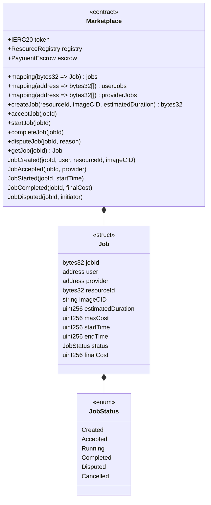
```mermaid
classDiagram
    class Marketplace {
        <<contract>>
        +IERC20 token
        +ResourceRegistry registry
        +PaymentEscrow escrow
        +mapping(bytes32 => Job) jobs
        +mapping(address => bytes32[]) userJobs
        +mapping(address => bytes32[]) providerJobs
        
        +createJob(resourceId, imageCID, estimatedDuration) bytes32
        +acceptJob(jobId)
        +startJob(jobId)
        +completeJob(jobId)
        +disputeJob(jobId, reason)
        +getJob(jobId) Job
        
        <<events>>
        JobCreated(jobId, user, resourceId, imageCID)
        JobAccepted(jobId, provider)
        JobStarted(jobId, startTime)
        JobCompleted(jobId, finalCost)
        JobDisputed(jobId, initiator)
    }
    
    class Job {
        <<struct>>
        bytes32 jobId
        address user
        address provider
        bytes32 resourceId
        string imageCID
        uint256 estimatedDuration
        uint256 maxCost
        uint256 startTime
        uint256 endTime
        JobStatus status
        uint256 finalCost
    }
    
    class JobStatus {
        <<enum>>
        Created
        Accepted
        Running
        Completed
        Disputed
        Cancelled
    }
    
    Marketplace *-- Job
    Job *-- JobStatus
```

**State Machine**:
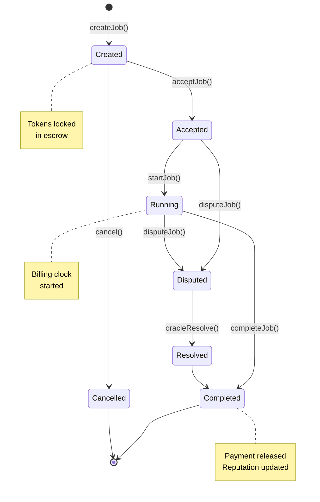
```mermaid
stateDiagram-v2
    [*] --> Created: createJob()
    
    Created --> Accepted: acceptJob()
    Created --> Cancelled: cancel()
    
    Accepted --> Running: startJob()
    Accepted --> Disputed: disputeJob()
    
    Running --> Completed: completeJob()
    Running --> Disputed: disputeJob()
    
    Disputed --> Resolved: oracleResolve()
    Resolved --> Completed
    
    Completed --> [*]
    Cancelled --> [*]
    
    note right of Created
        Tokens locked
        in escrow
    end note
    
    note right of Running
        Billing clock
        started
    end note
    
    note right of Completed
        Payment released
        Reputation updated
    end note
```

### 3.1.3 PaymentEscrow Contract

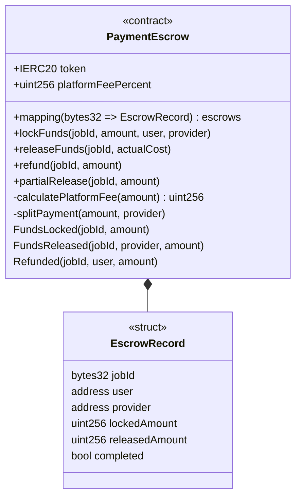
```mermaid
classDiagram
    class PaymentEscrow {
        <<contract>>
        +IERC20 token
        +uint256 platformFeePercent
        +mapping(bytes32 => EscrowRecord) escrows
        
        +lockFunds(jobId, amount, user, provider)
        +releaseFunds(jobId, actualCost)
        +refund(jobId, amount)
        +partialRelease(jobId, amount)
        
        -calculatePlatformFee(amount) uint256
        -splitPayment(amount, provider)
        
        <<events>>
        FundsLocked(jobId, amount)
        FundsReleased(jobId, provider, amount)
        Refunded(jobId, user, amount)
    }
    
    class EscrowRecord {
        <<struct>>
        bytes32 jobId
        address user
        address provider
        uint256 lockedAmount
        uint256 releasedAmount
        bool completed
    }
    
    PaymentEscrow *-- EscrowRecord
```

**Payment Flow**:
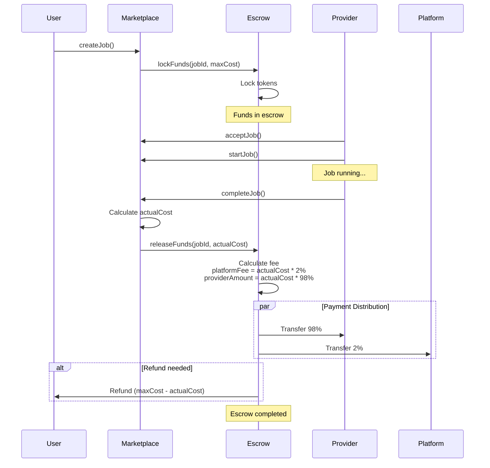
```mermaid
sequenceDiagram
    participant U as User
    participant M as Marketplace
    participant E as Escrow
    participant P as Provider
    participant Platform as Platform
    
    U->>M: createJob()
    M->>E: lockFunds(jobId, maxCost)
    E->>E: Lock tokens
    Note over E: Funds in escrow
    
    P->>M: acceptJob()
    P->>M: startJob()
    Note over P: Job running...
    
    P->>M: completeJob()
    M->>M: Calculate actualCost
    M->>E: releaseFunds(jobId, actualCost)
    
    E->>E: Calculate fee<br/>platformFee = actualCost * 2%<br/>providerAmount = actualCost * 98%
    
    par Payment Distribution
        E->>P: Transfer 98%
        E->>Platform: Transfer 2%
    end
    
    alt Refund needed
        E->>U: Refund (maxCost - actualCost)
    end
    
    Note over E: Escrow completed
```

### 3.1.4 ReputationSystem Contract

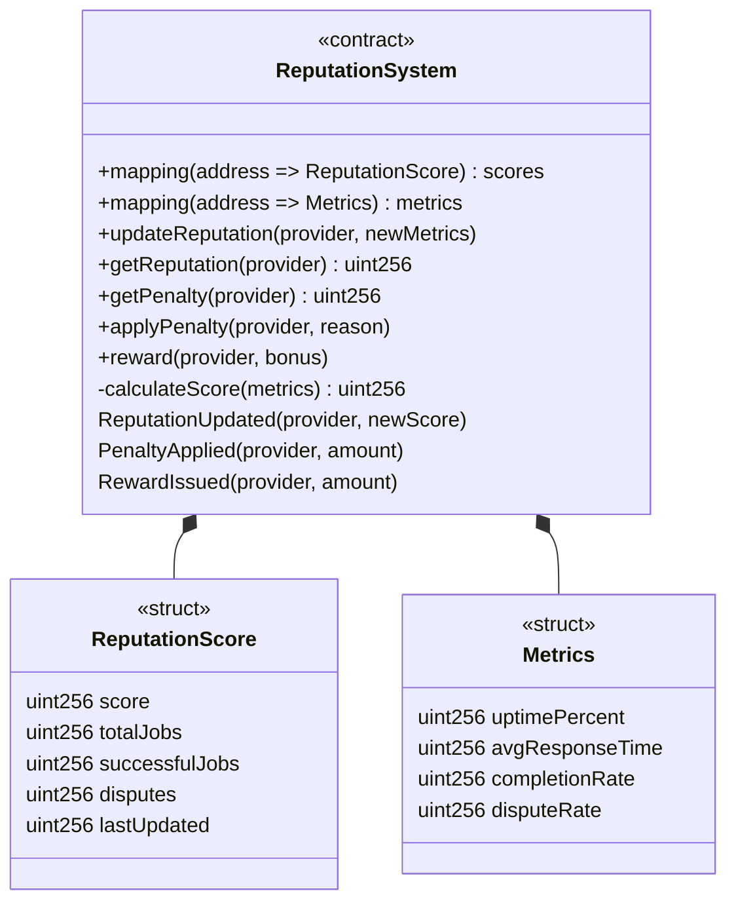
```mermaid
classDiagram
    class ReputationSystem {
        <<contract>>
        +mapping(address => ReputationScore) scores
        +mapping(address => Metrics) metrics
        
        +updateReputation(provider, newMetrics)
        +getReputation(provider) uint256
        +getPenalty(provider) uint256
        +applyPenalty(provider, reason)
        +reward(provider, bonus)
        
        -calculateScore(metrics) uint256
        
        <<events>>
        ReputationUpdated(provider, newScore)
        PenaltyApplied(provider, amount)
        RewardIssued(provider, amount)
    }
    
    class ReputationScore {
        <<struct>>
        uint256 score
        uint256 totalJobs
        uint256 successfulJobs
        uint256 disputes
        uint256 lastUpdated
    }
    
    class Metrics {
        <<struct>>
        uint256 uptimePercent
        uint256 avgResponseTime
        uint256 completionRate
        uint256 disputeRate
    }
    
    ReputationSystem *-- ReputationScore
    ReputationSystem *-- Metrics
```

**Score Calculation**:
```
reputation = (
  uptime * 0.4 +
  response * 0.2 +
  completion * 0.3 +
  (1 - disputes) * 0.1
) * 1000

Where:
- uptime: 실제 가동시간 / 약속시간 (0-1)
- response: 1 - (avg_response_time / max_acceptable_time) (0-1)
- completion: completed_jobs / total_jobs (0-1)
- disputes: dispute_count / total_jobs (0-1)

Score range: 0-1000
```

## 3.2 Backend Components

### 3.2.1 API Gateway Components

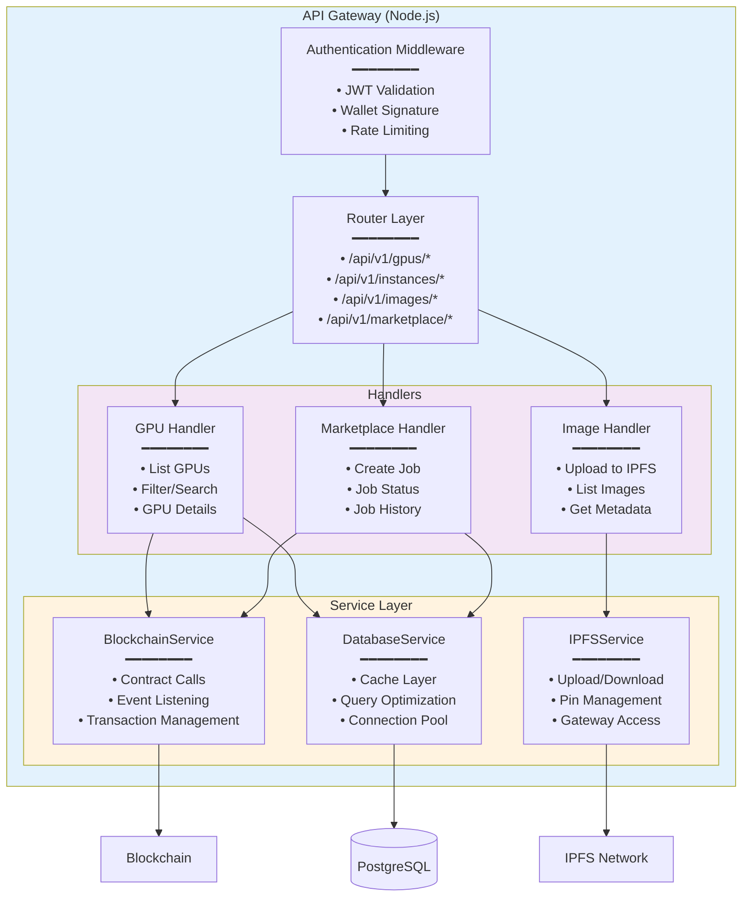
```mermaid
graph TB
    subgraph APIGateway["API Gateway (Node.js)"]
        Auth[Authentication Middleware<br/>━━━━━━━━<br/>• JWT Validation<br/>• Wallet Signature<br/>• Rate Limiting]
        
        Router[Router Layer<br/>━━━━━━━━<br/>• /api/v1/gpus/*<br/>• /api/v1/instances/*<br/>• /api/v1/images/*<br/>• /api/v1/marketplace/*]
        
        Auth --> Router
        
        subgraph Handlers["Handlers"]
            GPU[GPU Handler<br/>━━━━━━━━<br/>• List GPUs<br/>• Filter/Search<br/>• GPU Details]
            
            Image[Image Handler<br/>━━━━━━━━<br/>• Upload to IPFS<br/>• List Images<br/>• Get Metadata]
            
            Market[Marketplace Handler<br/>━━━━━━━━<br/>• Create Job<br/>• Job Status<br/>• Job History]
        end
        
        Router --> GPU
        Router --> Image
        Router --> Market
        
        subgraph Services["Service Layer"]
            BCS[BlockchainService<br/>━━━━━━━━<br/>• Contract Calls<br/>• Event Listening<br/>• Transaction Management]
            
            IPFSS[IPFSService<br/>━━━━━━━━<br/>• Upload/Download<br/>• Pin Management<br/>• Gateway Access]
            
            DBS[DatabaseService<br/>━━━━━━━━<br/>• Cache Layer<br/>• Query Optimization<br/>• Connection Pool]
        end
        
        GPU --> BCS
        GPU --> DBS
        Image --> IPFSS
        Market --> BCS
        Market --> DBS
    end
    
    BCS --> BC[Blockchain]
    IPFSS --> IPFS[IPFS Network]
    DBS --> DB[(PostgreSQL)]
    
    style APIGateway fill:#e3f2fd
    style Handlers fill:#f3e5f5
    style Services fill:#fff3e0
```

**Key Services**:
```typescript
// BlockchainService
class BlockchainService {
  async getResource(resourceId: string): Promise<GPUResource>;
  async createOrder(order: OrderParams): Promise<Transaction>;
  async watchEvents(eventName: string, callback: Function);
}

// IPFSService  
class IPFSService {
  async uploadImage(image: Buffer): Promise<string>; // returns CID
  async downloadImage(cid: string): Promise<Buffer>;
  async pinImage(cid: string): Promise<void>;
  async getImageMetadata(cid: string): Promise<Metadata>;
}

// DatabaseService
class DatabaseService {
  async cacheGPUList(gpus: GPUResource[]): Promise<void>;
  async searchGPUs(filters: SearchFilters): Promise<GPUResource[]>;
  async logInstance(instance: InstanceLog): Promise<void>;
}
```

### 3.2.2 Provider Agent Components

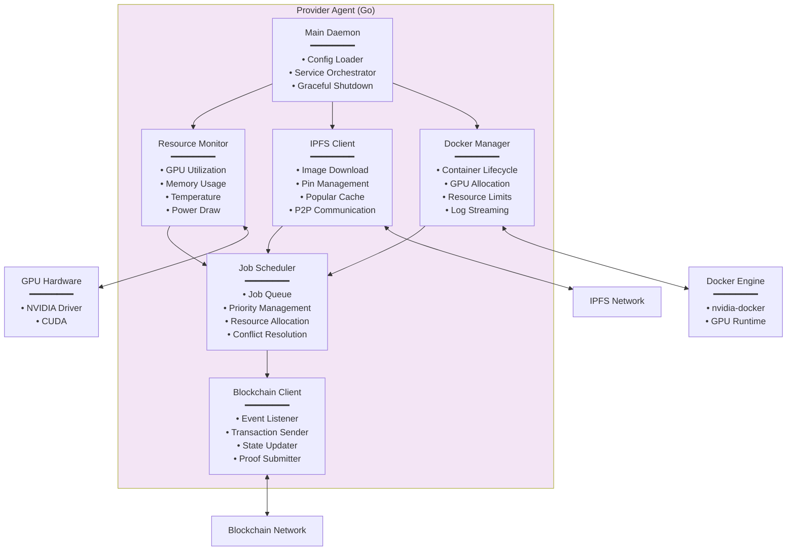
```mermaid
graph TB
    subgraph Agent["Provider Agent (Go)"]
        Main[Main Daemon<br/>━━━━━━━━<br/>• Config Loader<br/>• Service Orchestrator<br/>• Graceful Shutdown]
        
        Main --> Monitor
        Main --> IPFSClient
        Main --> DockerMgr
        
        Monitor[Resource Monitor<br/>━━━━━━━━<br/>• GPU Utilization<br/>• Memory Usage<br/>• Temperature<br/>• Power Draw]
        
        IPFSClient[IPFS Client<br/>━━━━━━━━<br/>• Image Download<br/>• Pin Management<br/>• Popular Cache<br/>• P2P Communication]
        
        DockerMgr[Docker Manager<br/>━━━━━━━━<br/>• Container Lifecycle<br/>• GPU Allocation<br/>• Resource Limits<br/>• Log Streaming]
        
        Monitor --> Scheduler
        IPFSClient --> Scheduler
        DockerMgr --> Scheduler
        
        Scheduler[Job Scheduler<br/>━━━━━━━━<br/>• Job Queue<br/>• Priority Management<br/>• Resource Allocation<br/>• Conflict Resolution]
        
        Scheduler --> BCClient
        
        BCClient[Blockchain Client<br/>━━━━━━━━<br/>• Event Listener<br/>• Transaction Sender<br/>• State Updater<br/>• Proof Submitter]
    end
    
    BCClient <--> BC[Blockchain Network]
    IPFSClient <--> IPFS[IPFS Network]
    DockerMgr <--> Docker[Docker Engine<br/>━━━━━━━━<br/>• nvidia-docker<br/>• GPU Runtime]
    Monitor <--> GPU[GPU Hardware<br/>━━━━━━━━<br/>• NVIDIA Driver<br/>• CUDA]
    
    style Agent fill:#f3e5f5
```

**Component Details**:
```go
// Resource Monitor
type ResourceMonitor struct {
    gpuDriver    GPUDriver
    sysInfo      SystemInfo
    reportTicker *time.Ticker
}

func (r *ResourceMonitor) CollectMetrics() Metrics {
    return Metrics{
        GPUUtil:       r.gpuDriver.GetUtilization(),
        MemoryUsed:    r.sysInfo.GetMemoryUsage(),
        Temperature:   r.gpuDriver.GetTemperature(),
        PowerDraw:     r.gpuDriver.GetPowerDraw(),
    }
}

// Docker Manager
type DockerManager struct {
    client *docker.Client
}

func (d *DockerManager) LaunchJob(job Job) (containerID string, err error) {
    // 1. Pull image from IPFS
    imageCID := job.ImageCID
    imageData := d.ipfs.GetImage(imageCID)
    
    // 2. Load into Docker
    d.client.LoadImage(imageData)
    
    // 3. Create container with GPU access
    container := d.client.CreateContainer(docker.CreateContainerOptions{
        Config: &docker.Config{
            Image: job.ImageName,
        },
        HostConfig: &docker.HostConfig{
            Runtime: "nvidia",
            DeviceRequests: []docker.DeviceRequest{{
                Capabilities: [][]string{{"gpu"}},
            }},
        },
    })
    
    // 4. Start container
    d.client.StartContainer(container.ID)
    
    return container.ID, nil
}

// IPFS Client
type IPFSClient struct {
    shell *shell.Shell
}

func (i *IPFSClient) CachePopularImages() {
    // Get popular images from marketplace
    popular := i.getPopularImages()
    
    for _, cid := range popular {
        if !i.HasLocal(cid) {
            i.shell.Pin(cid)
            log.Printf("Cached image: %s", cid)
        }
    }
}
```

### 3.2.3 Indexer Service Components

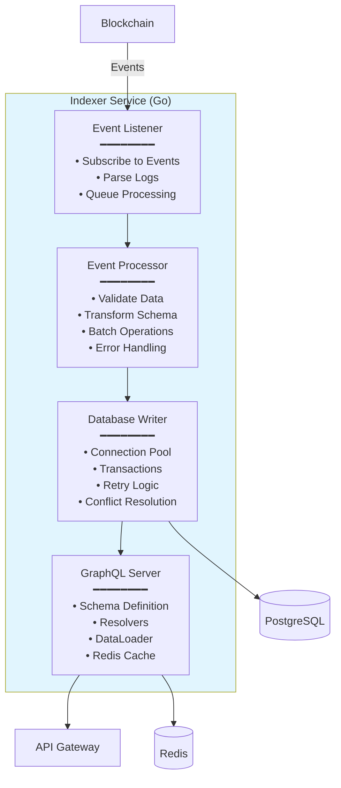
```mermaid
graph TB
    subgraph Indexer["Indexer Service (Go)"]
        Listener[Event Listener<br/>━━━━━━━━<br/>• Subscribe to Events<br/>• Parse Logs<br/>• Queue Processing]
        
        Listener --> Processor
        
        Processor[Event Processor<br/>━━━━━━━━<br/>• Validate Data<br/>• Transform Schema<br/>• Batch Operations<br/>• Error Handling]
        
        Processor --> Writer
        
        Writer[Database Writer<br/>━━━━━━━━<br/>• Connection Pool<br/>• Transactions<br/>• Retry Logic<br/>• Conflict Resolution]
        
        Writer --> GQL
        
        GQL[GraphQL Server<br/>━━━━━━━━<br/>• Schema Definition<br/>• Resolvers<br/>• DataLoader<br/>• Redis Cache]
    end
    
    BC[Blockchain] -->|Events| Listener
    Writer --> DB[(PostgreSQL)]
    GQL --> API[API Gateway]
    GQL --> Cache[(Redis)]
    
    style Indexer fill:#e1f5fe
```

**GraphQL Schema**:
```graphql
type GPUResource {
  id: ID!
  provider: String!
  gpuModel: String!
  vcpu: Int!
  memoryGB: Int!
  pricePerHour: Float!
  available: Boolean!
  reputation: Int!
  location: String
  uptime: Float!
}

type Job {
  id: ID!
  user: String!
  provider: String!
  resourceId: ID!
  imageCID: String!
  status: JobStatus!
  startTime: Int
  endTime: Int
  totalCost: Float
}

enum JobStatus {
  PENDING
  RUNNING
  COMPLETED
  FAILED
  DISPUTED
}

type Query {
  gpus(
    filters: GPUFilters
    sort: SortOptions
    limit: Int
    offset: Int
  ): [GPUResource!]!
  
  gpu(id: ID!): GPUResource
  
  jobs(
    user: String
    provider: String
    status: JobStatus
  ): [Job!]!
  
  job(id: ID!): Job
  
  myJobs(address: String!): [Job!]!
}

type Subscription {
  jobStatusChanged(jobId: ID!): Job
  newGPUAvailable: GPUResource
}
```

### 3.2.4 Oracle Service Components

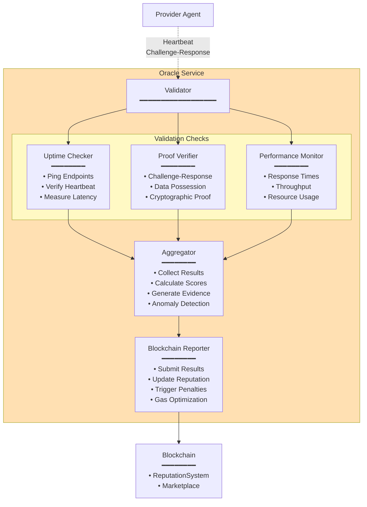
```mermaid
graph TB
    subgraph Oracle["Oracle Service"]
        Validator[Validator<br/>━━━━━━━━━━━━━━━━━━]
        
        subgraph Checks["Validation Checks"]
            Uptime[Uptime Checker<br/>━━━━━━━━<br/>• Ping Endpoints<br/>• Verify Heartbeat<br/>• Measure Latency]
            
            Proof[Proof Verifier<br/>━━━━━━━━<br/>• Challenge-Response<br/>• Data Possession<br/>• Cryptographic Proof]
            
            Perf[Performance Monitor<br/>━━━━━━━━<br/>• Response Times<br/>• Throughput<br/>• Resource Usage]
        end
        
        Validator --> Uptime
        Validator --> Proof
        Validator --> Perf
        
        Uptime --> Aggregator
        Proof --> Aggregator
        Perf --> Aggregator
        
        Aggregator[Aggregator<br/>━━━━━━━━<br/>• Collect Results<br/>• Calculate Scores<br/>• Generate Evidence<br/>• Anomaly Detection]
        
        Aggregator --> Reporter
        
        Reporter[Blockchain Reporter<br/>━━━━━━━━<br/>• Submit Results<br/>• Update Reputation<br/>• Trigger Penalties<br/>• Gas Optimization]
    end
    
    Provider[Provider Agent] -.->|Heartbeat<br/>Challenge-Response| Validator
    Reporter --> BC[Blockchain<br/>━━━━━━━━<br/>• ReputationSystem<br/>• Marketplace]
    
    style Oracle fill:#ffe0b2
    style Checks fill:#fff9c4
```

**Validation Protocol**:
```go
// Challenge-Response for IPFS Data Possession
type Challenge struct {
    CID        string
    Offset     int64  // Random offset in file
    Length     int    // Bytes to return
    Nonce      string
    Expiry     int64
}

type Response struct {
    CID        string
    Data       []byte // Requested chunk
    Signature  []byte // Provider's signature
}

func (o *Oracle) ValidateDataPossession(
    provider string,
    imageCID string,
) (bool, error) {
    // 1. Generate random challenge
    challenge := Challenge{
        CID:    imageCID,
        Offset: rand.Int63n(imageSize),
        Length: 1024,
        Nonce:  generateNonce(),
        Expiry: time.Now().Add(30 * time.Second).Unix(),
    }
    
    // 2. Send to provider
    response := o.sendChallenge(provider, challenge)
    
    // 3. Verify response
    // 3a. Get expected data from our IPFS node
    expected := o.ipfs.GetChunk(imageCID, challenge.Offset, challenge.Length)
    
    // 3b. Compare
    if !bytes.Equal(response.Data, expected) {
        return false, errors.New("data mismatch")
    }
    
    // 3c. Verify signature
    valid := o.verifySignature(provider, response)
    
    return valid, nil
}
```

## 3.3 Frontend Components

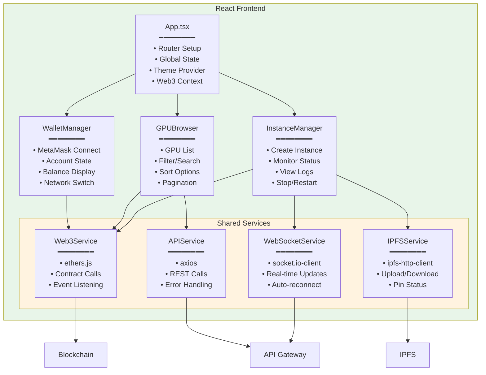
```mermaid
graph TB
    subgraph Frontend["React Frontend"]
        App[App.tsx<br/>━━━━━━━━<br/>• Router Setup<br/>• Global State<br/>• Theme Provider<br/>• Web3 Context]
        
        App --> Wallet
        App --> Browser
        App --> Instance
        
        Wallet[WalletManager<br/>━━━━━━━━<br/>• MetaMask Connect<br/>• Account State<br/>• Balance Display<br/>• Network Switch]
        
        Browser[GPUBrowser<br/>━━━━━━━━<br/>• GPU List<br/>• Filter/Search<br/>• Sort Options<br/>• Pagination]
        
        Instance[InstanceManager<br/>━━━━━━━━<br/>• Create Instance<br/>• Monitor Status<br/>• View Logs<br/>• Stop/Restart]
        
        subgraph Services["Shared Services"]
            Web3[Web3Service<br/>━━━━━━━━<br/>• ethers.js<br/>• Contract Calls<br/>• Event Listening]
            
            IPFSS[IPFSService<br/>━━━━━━━━<br/>• ipfs-http-client<br/>• Upload/Download<br/>• Pin Status]
            
            APIS[APIService<br/>━━━━━━━━<br/>• axios<br/>• REST Calls<br/>• Error Handling]
            
            WSS[WebSocketService<br/>━━━━━━━━<br/>• socket.io-client<br/>• Real-time Updates<br/>• Auto-reconnect]
        end
        
        Wallet --> Web3
        Browser --> APIS
        Browser --> Web3
        Instance --> Web3
        Instance --> WSS
        Instance --> IPFSS
    end
    
    Web3 --> BC[Blockchain]
    IPFSS --> IPFS[IPFS]
    APIS --> API[API Gateway]
    WSS --> API
    
    style Frontend fill:#e8f5e9
    style Services fill:#fff3e0
```

**Key Components**:
```typescript
// WalletManager.tsx
const WalletManager = () => {
  const [account, setAccount] = useState<string | null>(null);
  const [provider, setProvider] = useState<BrowserProvider | null>(null);
  
  const connect = async () => {
    if (window.ethereum) {
      const provider = new BrowserProvider(window.ethereum);
      const accounts = await provider.send("eth_requestAccounts", []);
      setAccount(accounts[0]);
      setProvider(provider);
    }
  };
  
  return (
    <WalletContext.Provider value={{ account, provider, connect }}>
      {children}
    </WalletContext.Provider>
  );
};

// GPUBrowser.tsx
const GPUBrowser = () => {
  const [gpus, setGPUs] = useState<GPUResource[]>([]);
  const [filters, setFilters] = useState<Filters>({});
  
  useEffect(() => {
    // GraphQL query via Indexer
    const fetchGPUs = async () => {
      const result = await graphqlClient.query({
        query: GET_GPUS,
        variables: { filters }
      });
      setGPUs(result.data.gpus);
    };
    fetchGPUs();
  }, [filters]);
  
  return (
    <div>
      <FilterPanel onChange={setFilters} />
      <GPUList gpus={gpus} onSelect={handleSelect} />
    </div>
  );
};

// InstanceManager.tsx
const InstanceManager = () => {
  const { account, provider } = useWallet();
  const [instances, setInstances] = useState<Instance[]>([]);
  
  const launchInstance = async (gpuId: string, imageCID: string) => {
    // 1. Create order on blockchain
    const contract = new Contract(MARKETPLACE_ADDR, ABI, provider);
    const tx = await contract.createOrder(gpuId, imageCID, duration);
    await tx.wait();
    
    // 2. Wait for provider to accept
    // WebSocket notification
  };
  
  return (
    <div>
      <InstanceList instances={instances} />
      <LaunchButton onClick={launchInstance} />
    </div>
  );
};
```

---

# Level 4: Data Flow Diagrams

## 4.1 Job Creation Flow

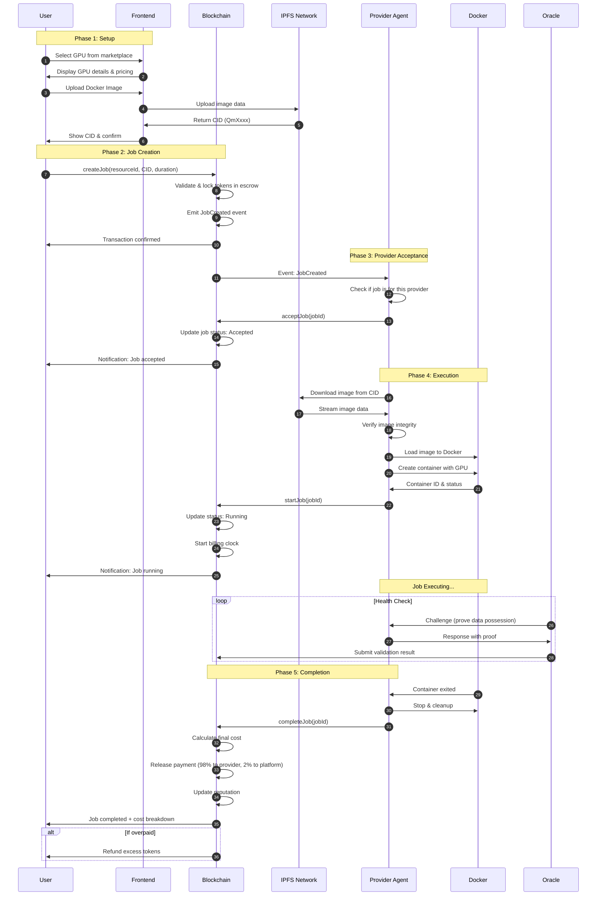
```mermaid
sequenceDiagram
    autonumber
    participant U as User
    participant F as Frontend
    participant BC as Blockchain
    participant IPFS as IPFS Network
    participant PA as Provider Agent
    participant D as Docker
    participant O as Oracle
    
    Note over U,F: Phase 1: Setup
    U->>F: Select GPU from marketplace
    F->>U: Display GPU details & pricing
    
    U->>F: Upload Docker Image
    F->>IPFS: Upload image data
    IPFS->>F: Return CID (QmXxxx)
    F->>U: Show CID & confirm
    
    Note over U,BC: Phase 2: Job Creation
    U->>BC: createJob(resourceId, CID, duration)
    BC->>BC: Validate & lock tokens in escrow
    BC->>BC: Emit JobCreated event
    BC->>U: Transaction confirmed
    
    Note over PA: Phase 3: Provider Acceptance
    BC->>PA: Event: JobCreated
    PA->>PA: Check if job is for this provider
    PA->>BC: acceptJob(jobId)
    BC->>BC: Update job status: Accepted
    BC->>U: Notification: Job accepted
    
    Note over PA,D: Phase 4: Execution
    PA->>IPFS: Download image from CID
    IPFS->>PA: Stream image data
    PA->>PA: Verify image integrity
    
    PA->>D: Load image to Docker
    PA->>D: Create container with GPU
    D->>PA: Container ID & status
    
    PA->>BC: startJob(jobId)
    BC->>BC: Update status: Running
    BC->>BC: Start billing clock
    BC->>U: Notification: Job running
    
    Note over PA,D: Job Executing...
    loop Health Check
        O->>PA: Challenge (prove data possession)
        PA->>O: Response with proof
        O->>BC: Submit validation result
    end
    
    Note over PA,BC: Phase 5: Completion
    D->>PA: Container exited
    PA->>D: Stop & cleanup
    
    PA->>BC: completeJob(jobId)
    BC->>BC: Calculate final cost
    BC->>BC: Release payment (98% to provider, 2% to platform)
    BC->>BC: Update reputation
    BC->>U: Job completed + cost breakdown
    
    alt If overpaid
        BC->>U: Refund excess tokens
    end
```

## 4.2 IPFS Image Distribution Flow

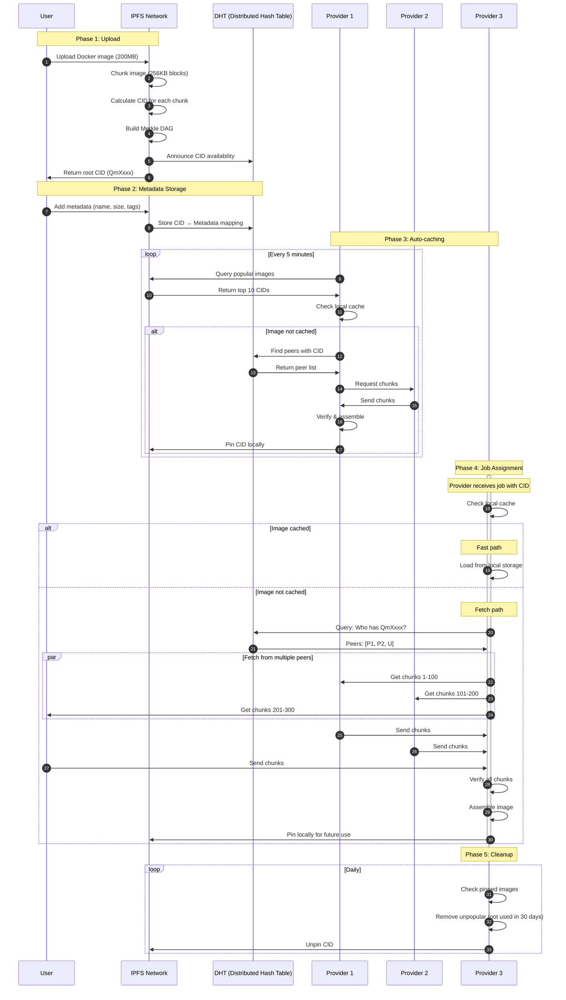
```mermaid
sequenceDiagram
    autonumber
    participant U as User
    participant IPFS as IPFS Network
    participant DHT as DHT (Distributed Hash Table)
    participant P1 as Provider 1
    participant P2 as Provider 2
    participant P3 as Provider 3
    
    Note over U,IPFS: Phase 1: Upload
    U->>IPFS: Upload Docker image (200MB)
    IPFS->>IPFS: Chunk image (256KB blocks)
    IPFS->>IPFS: Calculate CID for each chunk
    IPFS->>IPFS: Build Merkle DAG
    IPFS->>DHT: Announce CID availability
    IPFS->>U: Return root CID (QmXxxx)
    
    Note over U,DHT: Phase 2: Metadata Storage
    U->>IPFS: Add metadata (name, size, tags)
    IPFS->>DHT: Store CID → Metadata mapping
    
    Note over P1,P3: Phase 3: Auto-caching
    loop Every 5 minutes
        P1->>IPFS: Query popular images
        IPFS->>P1: Return top 10 CIDs
        P1->>P1: Check local cache
        
        alt Image not cached
            P1->>DHT: Find peers with CID
            DHT->>P1: Return peer list
            P1->>P2: Request chunks
            P2->>P1: Send chunks
            P1->>P1: Verify & assemble
            P1->>IPFS: Pin CID locally
        end
    end
    
    Note over P3: Phase 4: Job Assignment
    activate P3
    Note over P3: Provider receives job with CID
    
    P3->>P3: Check local cache
    
    alt Image cached
        Note over P3: Fast path
        P3->>P3: Load from local storage
    else Image not cached
        Note over P3: Fetch path
        P3->>DHT: Query: Who has QmXxxx?
        DHT->>P3: Peers: [P1, P2, U]
        
        par Fetch from multiple peers
            P3->>P1: Get chunks 1-100
            P3->>P2: Get chunks 101-200
            P3->>U: Get chunks 201-300
        end
        
        P1->>P3: Send chunks
        P2->>P3: Send chunks
        U->>P3: Send chunks
        
        P3->>P3: Verify all chunks
        P3->>P3: Assemble image
        P3->>IPFS: Pin locally for future use
    end
    
    deactivate P3
    
    Note over P3: Phase 5: Cleanup
    loop Daily
        P3->>P3: Check pinned images
        P3->>P3: Remove unpopular (not used in 30 days)
        P3->>IPFS: Unpin CID
    end
```

## 4.3 Payment & Reputation Flow

```mermaid
sequenceDiagram
    autonumber
    participant U as User
    participant M as Marketplace
    participant E as Escrow
    participant P as Provider
    participant R as Reputation
    participant Token as GPUToken
    
    Note over U,M: Phase 1: Job Initiation
    U->>Token: Approve Marketplace
    Token->>U: Approval confirmed
    
    U->>M: createJob(resourceId, imageCID, 3600s)
    M->>M: Get GPU pricing: 10 tokens/hour
    M->>M: Calculate maxCost: 10 tokens
    
    M->>Token: transferFrom(user, escrow, 10 tokens)
    Token->>E: Transfer 10 tokens
    E->>E: Lock funds for jobId
    M->>M: Create job record
    M->>U: Job created (jobId)
    
    Note over P: Phase 2: Job Execution
    M->>P: JobCreated event
    P->>M: acceptJob(jobId)
    P->>M: startJob(jobId)
    M->>M: Record startTime: T0
    
    Note over P: Job running for 2700 seconds (45 minutes)
    
    Note over P,M: Phase 3: Completion
    P->>M: completeJob(jobId)
    M->>M: Record endTime: T0 + 2700s
    M->>M: Calculate actual cost
    Note over M: actualDuration = 2700s<br/>actualCost = (10 tokens/hour) * (2700/3600)<br/>= 7.5 tokens
    
    Note over M,E: Phase 4: Payment Distribution
    M->>E: releaseFunds(jobId, 7.5 tokens)
    E->>E: Calculate distribution
    Note over E: providerAmount = 7.5 * 0.98 = 7.35 tokens<br/>platformFee = 7.5 * 0.02 = 0.15 tokens
    
    par Payment Transfer
        E->>Token: transfer(provider, 7.35 tokens)
        Token->>P: Receive 7.35 tokens
        E->>Token: transfer(platform, 0.15 tokens)
    end
    
    alt Refund Excess
        E->>Token: transfer(user, 2.5 tokens)
        Token->>U: Refund 2.5 tokens
    end
    
    Note over M,R: Phase 5: Reputation Update
    M->>R: updateReputation(provider, metrics)
    
    R->>R: Fetch current metrics
    Note over R: Current:<br/>totalJobs: 100<br/>successfulJobs: 98<br/>avgUptime: 99.2%<br/>disputes: 1
    
    R->>R: Add new job data
    Note over R: New metrics:<br/>totalJobs: 101<br/>successfulJobs: 99<br/>Duration: 2700s (100% of expected)<br/>Response: instant<br/>No disputes
    
    R->>R: Calculate new score
    Note over R: score = (<br/>  uptime: 0.992 * 0.4 +<br/>  response: 1.0 * 0.2 +<br/>  completion: 0.98 * 0.3 +<br/>  disputes: 0.99 * 0.1<br/>) * 1000<br/>= 981 points
    
    R->>M: Reputation updated: 981
    M->>P: New reputation score
    
    Note over U,P: Transaction Complete
```

## 4.4 Oracle Validation Flow

```mermaid
sequenceDiagram
    autonumber
    participant BC as Blockchain
    participant O as Oracle
    participant P as Provider
    participant IPFS as IPFS
    participant R as Reputation
    
    Note over BC,P: Phase 1: Heartbeat Monitoring
    loop Every 60 seconds
        P->>O: Heartbeat + Metrics
        Note over P: {<br/>  timestamp: now,<br/>  jobsRunning: 3,<br/>  gpuUtil: 85%,<br/>  uptime: 99.5%<br/>}
        
        O->>O: Record heartbeat
        O->>O: Check if on-time
        
        alt Heartbeat missed
            O->>O: Increment miss counter
            Note over O: missCount++
            
            alt Miss count > 3
                O->>BC: reportDowntime(provider)
                BC->>R: applyPenalty(provider, "downtime")
                R->>R: Reduce reputation by 50 points
            end
        end
    end
    
    Note over O,P: Phase 2: Random Challenge
    O->>O: Generate random challenge
    Note over O: Select random job from provider<br/>jobId: 0xabc...<br/>imageCID: QmXxxx
    
    O->>O: Create challenge
    Note over O: {<br/>  cid: QmXxxx,<br/>  offset: random(0, fileSize),<br/>  length: 1024 bytes,<br/>  nonce: random(),<br/>  expiry: now + 30s<br/>}
    
    O->>P: Send challenge
    
    Note over P: Phase 3: Provider Response
    P->>P: Receive challenge
    P->>IPFS: Read chunk at offset
    IPFS->>P: Return chunk data
    P->>P: Sign response
    P->>O: Send response
    Note over P: {<br/>  cid: QmXxxx,<br/>  data: [chunk bytes],<br/>  signature: sign(data, privateKey)<br/>}
    
    Note over O: Phase 4: Verification
    O->>O: Check response time
    
    alt Response > 30s
        O->>BC: reportTimeout(provider, jobId)
        BC->>R: applyPenalty(provider, "timeout")
    else Response within 30s
        O->>IPFS: Fetch expected chunk
        IPFS->>O: Return chunk
        
        O->>O: Compare chunks
        
        alt Data mismatch
            O->>BC: reportInvalidData(provider, jobId)
            BC->>R: applyPenalty(provider, "data_fraud")
            R->>R: Severe penalty: -200 points
            BC->>BC: Slash provider stake
        else Data matches
            O->>O: Verify signature
            
            alt Invalid signature
                O->>BC: reportInvalidSignature(provider)
                BC->>R: applyPenalty(provider, "invalid_sig")
            else Valid
                O->>O: Record successful validation
                Note over O: Success! Provider passed challenge
            end
        end
    end
    
    Note over O,BC: Phase 5: Periodic Reporting
    loop Every 1 hour
        O->>O: Aggregate validation results
        Note over O: For provider 0x123:<br/>- Heartbeats: 60/60 ✓<br/>- Challenges: 10/10 ✓<br/>- Avg response: 2.3s<br/>- Uptime: 100%
        
        O->>BC: submitValidationReport(provider, results)
        BC->>R: updateMetrics(provider, metrics)
        R->>R: Recalculate reputation
        R->>BC: New reputation: 985 (+4)
    end
    
    Note over BC,R: Phase 6: Dispute Resolution
    alt User disputes job
        BC->>O: Investigate dispute
        Note over BC: disputeId: 0xdef<br/>jobId: 0xabc<br/>reason: "job failed"
        
        O->>O: Collect evidence
        O->>P: Request job logs
        P->>O: Send logs
        O->>IPFS: Verify image integrity
        O->>BC: Check on-chain records
        
        O->>O: Analyze evidence
        
        alt Provider at fault
            O->>BC: resolveDispute(disputeId, "provider_fault")
            BC->>BC: Refund user
            BC->>R: applyPenalty(provider, "dispute_lost")
        else User at fault
            O->>BC: resolveDispute(disputeId, "user_fault")
            BC->>BC: Pay provider
        else Inconclusive
            O->>BC: resolveDispute(disputeId, "split_payment")
            BC->>BC: Split payment 50/50
        end
    end
```

---

# Security Architecture

## 5.1 Threat Model & Mitigations

```mermaid
graph TB
    subgraph Threats["Security Threats"]
        T1[Smart Contract<br/>━━━━━━━━<br/>• Reentrancy<br/>• Integer Overflow<br/>• Front-running<br/>• Access Control]
        
        T2[IPFS<br/>━━━━━━━━<br/>• Data Availability<br/>• Content Poisoning<br/>• Sybil Attacks<br/>• DHT Pollution]
        
        T3[Provider Agent<br/>━━━━━━━━<br/>• Container Escape<br/>• Resource Exhaustion<br/>• Data Exfiltration<br/>• Malicious Images]
        
        T4[Network<br/>━━━━━━━━<br/>• DDoS<br/>• Man-in-Middle<br/>• Replay Attacks<br/>• Eclipse Attacks]
    end
    
    subgraph Mitigations["Security Mitigations"]
        M1[Smart Contract Security<br/>━━━━━━━━<br/>✓ ReentrancyGuard<br/>✓ SafeMath (0.8.x)<br/>✓ Access Control<br/>✓ Formal Verification<br/>✓ Audits]
        
        M2[IPFS Security<br/>━━━━━━━━<br/>✓ Incentivized Pinning<br/>✓ Content Scanning<br/>✓ Stake Requirements<br/>✓ Oracle Validation<br/>✓ Backup Clusters]
        
        M3[Container Security<br/>━━━━━━━━<br/>✓ Docker Isolation<br/>✓ seccomp Profiles<br/>✓ Resource Limits<br/>✓ Network Policies<br/>✓ Image Scanning]
        
        M4[Network Security<br/>━━━━━━━━<br/>✓ DDoS Protection<br/>✓ TLS/SSL<br/>✓ Nonce Validation<br/>✓ Peer Reputation<br/>✓ Rate Limiting]
    end
    
    T1 --> M1
    T2 --> M2
    T3 --> M3
    T4 --> M4
    
    style Threats fill:#ffebee
    style Mitigations fill:#e8f5e9
```

## 5.2 Defense in Depth

```mermaid
graph TB
    subgraph Layer1["Layer 1: Network Security"]
        L1A[DDoS Protection<br/>━━━━━━━━<br/>• Cloudflare<br/>• Rate Limiting<br/>• IP Filtering]
        
        L1B[Firewall<br/>━━━━━━━━<br/>• Ingress Rules<br/>• Egress Rules<br/>• Port Restrictions]
        
        L1C[VPC Isolation<br/>━━━━━━━━<br/>• Private Subnets<br/>• Network ACLs<br/>• Security Groups]
    end
    
    subgraph Layer2["Layer 2: Application Security"]
        L2A[Input Validation<br/>━━━━━━━━<br/>• Schema Validation<br/>• Sanitization<br/>• Type Checking]
        
        L2B[Authentication<br/>━━━━━━━━<br/>• Wallet Signature<br/>• JWT Tokens<br/>• Session Management]
        
        L2C[Authorization<br/>━━━━━━━━<br/>• Role-Based Access<br/>• Resource Ownership<br/>• Permission Checks]
    end
    
    subgraph Layer3["Layer 3: Smart Contract Security"]
        L3A[Access Control<br/>━━━━━━━━<br/>• Ownable<br/>• Roles<br/>• Modifiers]
        
        L3B[Safety Checks<br/>━━━━━━━━<br/>• ReentrancyGuard<br/>• Overflow Protection<br/>• State Validation]
        
        L3C[Upgradability<br/>━━━━━━━━<br/>• Proxy Pattern<br/>• Emergency Pause<br/>• Timelock]
    end
    
    subgraph Layer4["Layer 4: Container Security"]
        L4A[Isolation<br/>━━━━━━━━<br/>• Namespace<br/>• cgroups<br/>• Capabilities]
        
        L4B[Resource Limits<br/>━━━━━━━━<br/>• CPU Quota<br/>• Memory Limit<br/>• Disk I/O]
        
        L4C[Scanning<br/>━━━━━━━━<br/>• Vulnerability Scan<br/>• Malware Detection<br/>• Static Analysis]
    end
    
    subgraph Layer5["Layer 5: Data Security"]
        L5A[Encryption at Rest<br/>━━━━━━━━<br/>• Database Encryption<br/>• Disk Encryption<br/>• Key Management]
        
        L5B[Encryption in Transit<br/>━━━━━━━━<br/>• TLS 1.3<br/>• Certificate Pinning<br/>• Perfect Forward Secrecy]
        
        L5C[Access Logging<br/>━━━━━━━━<br/>• Audit Trails<br/>• Anomaly Detection<br/>• SIEM Integration]
    end
    
    Layer1 --> Layer2
    Layer2 --> Layer3
    Layer3 --> Layer4
    Layer4 --> Layer5
    
    style Layer1 fill:#e3f2fd
    style Layer2 fill:#f3e5f5
    style Layer3 fill:#fff9c4
    style Layer4 fill:#ffccbc
    style Layer5 fill:#c8e6c9
```

---

# Deployment Architecture

## 6.1 Infrastructure Layout

```mermaid
graph TB
    subgraph Internet["Internet"]
        Users[End Users<br/>━━━━━━━━<br/>• Web Browsers<br/>• Mobile Apps]
        Providers[GPU Providers<br/>━━━━━━━━<br/>• Provider Agents<br/>• IPFS Nodes]
    end
    
    subgraph CDN["CDN Layer"]
        CF[Cloudflare<br/>━━━━━━━━<br/>• DDoS Protection<br/>• SSL/TLS<br/>• Caching<br/>• WAF]
    end
    
    subgraph Region1["Region 1 - Primary (US-East)"]
        LB1[Load Balancer<br/>━━━━━━━━<br/>• Health Checks<br/>• SSL Termination<br/>• Sticky Sessions]
        
        subgraph AppCluster1["Application Cluster"]
            API1A[API Gateway 1]
            API1B[API Gateway 2]
            API1C[API Gateway 3]
            
            IDX1A[Indexer 1]
            IDX1B[Indexer 2]
            
            ORC1A[Oracle 1]
            ORC1B[Oracle 2]
        end
        
        subgraph DataLayer1["Data Layer"]
            PG1[(PostgreSQL<br/>Primary<br/>━━━━━━━━<br/>• Master Node<br/>• Write/Read<br/>• Streaming Replication)]
            
            Redis1[(Redis Cluster<br/>━━━━━━━━<br/>• Cache<br/>• Session Store<br/>• Pub/Sub)]
        end
        
        subgraph Blockchain1["Blockchain Cluster"]
            BC1A[Validator Node 1<br/>━━━━━━━━<br/>• Block Production<br/>• Consensus<br/>• Full Archive]
            
            BC1B[Validator Node 2<br/>━━━━━━━━<br/>• Block Production<br/>• Consensus<br/>• Full Archive]
            
            BC1C[RPC Node<br/>━━━━━━━━<br/>• Public RPC<br/>• Read-only<br/>• Fast Sync]
        end
        
        subgraph IPFS1["IPFS Cluster"]
            IPFS1A[IPFS Node 1<br/>━━━━━━━━<br/>• Gateway<br/>• Pinning<br/>• 500GB Storage]
            
            IPFS1B[IPFS Node 2<br/>━━━━━━━━<br/>• Gateway<br/>• Pinning<br/>• 500GB Storage]
            
            IPFS1C[IPFS Node 3<br/>━━━━━━━━<br/>• Gateway<br/>• Pinning<br/>• 500GB Storage]
        end
        
        LB1 --> API1A
        LB1 --> API1B
        LB1 --> API1C
        
        API1A --> PG1
        API1A --> Redis1
        API1B --> PG1
        API1B --> Redis1
        API1C --> PG1
        API1C --> Redis1
        
        IDX1A --> PG1
        IDX1B --> PG1
        
        IDX1A --> BC1C
        IDX1B --> BC1C
        
        ORC1A --> BC1C
        ORC1B --> BC1C
    end
    
    subgraph Region2["Region 2 - DR (EU-West)"]
        LB2[Load Balancer<br/>Standby]
        
        subgraph AppCluster2["Application Cluster"]
            API2A[API Gateway<br/>Standby]
        end
        
        PG2[(PostgreSQL<br/>Replica<br/>━━━━━━━━<br/>• Read-only<br/>• Async Replication<br/>• Failover Ready)]
        
        BC2[Blockchain Node<br/>━━━━━━━━<br/>• Full Node<br/>• Standby Validator]
        
        IPFS2[IPFS Cluster<br/>━━━━━━━━<br/>• Backup Gateway<br/>• Popular Content]
    end
    
    subgraph ProviderNetwork["Distributed Provider Network"]
        PA1[Provider Agent 1<br/>━━━━━━━━<br/>• RTX 4090<br/>• 128GB RAM<br/>• San Francisco]
        
        PA2[Provider Agent 2<br/>━━━━━━━━<br/>• A100<br/>• 256GB RAM<br/>• London]
        
        PA3[Provider Agent N<br/>━━━━━━━━<br/>• RTX 3090<br/>• 64GB RAM<br/>• Tokyo]
    end
    
    subgraph Monitoring["Monitoring & Logging"]
        Prom[Prometheus<br/>━━━━━━━━<br/>• Metrics Collection<br/>• Time Series DB<br/>• Alerting]
        
        Graf[Grafana<br/>━━━━━━━━<br/>• Dashboards<br/>• Visualization<br/>• Alerting]
        
        ELK[ELK Stack<br/>━━━━━━━━<br/>• Centralized Logs<br/>• Search<br/>• Analytics]
        
        Jaeger[Jaeger<br/>━━━━━━━━<br/>• Distributed Tracing<br/>• Performance<br/>• Debugging]
    end
    
    Users --> CF
    Providers --> CF
    CF --> LB1
    
    PG1 -.->|Replication| PG2
    BC1A -.->|Sync| BC2
    IPFS1A -.->|Backup| IPFS2
    
    PA1 --> LB1
    PA2 --> LB1
    PA3 --> LB1
    
    API1A --> Prom
    API1B --> Prom
    IDX1A --> Prom
    BC1A --> Prom
    IPFS1A --> Prom
    
    Prom --> Graf
    
    API1A --> ELK
    IDX1A --> ELK
    PA1 --> ELK
    
    API1A --> Jaeger
    
    style Internet fill:#e8f5e9
    style CDN fill:#fff3e0
    style Region1 fill:#e3f2fd
    style Region2 fill:#f3e5f5
    style ProviderNetwork fill:#fce4ec
    style Monitoring fill:#f1f8e9
```

## 6.2 Scalability & High Availability

```mermaid
graph LR
    subgraph Horizontal["Horizontal Scaling"]
        H1[API Gateway<br/>━━━━━━━━<br/>Stateless<br/>━━━━━━━━<br/>Auto-scaling<br/>Min: 3, Max: 20]
        
        H2[Indexer Service<br/>━━━━━━━━<br/>Stateless<br/>━━━━━━━━<br/>Auto-scaling<br/>Min: 2, Max: 10]
        
        H3[Oracle Service<br/>━━━━━━━━<br/>Stateless<br/>━━━━━━━━<br/>Auto-scaling<br/>Min: 2, Max: 5]
    end
    
    subgraph Vertical["Vertical Scaling"]
        V1[PostgreSQL<br/>━━━━━━━━<br/>Scale-up<br/>━━━━━━━━<br/>CPU: 64 cores<br/>RAM: 512GB<br/>SSD: 4TB NVMe]
        
        V2[Blockchain Node<br/>━━━━━━━━<br/>Scale-up<br/>━━━━━━━━<br/>CPU: 32 cores<br/>RAM: 256GB<br/>SSD: 2TB NVMe]
    end
    
    subgraph HA["High Availability"]
        HA1[Multi-AZ Deployment<br/>━━━━━━━━<br/>• 3 Availability Zones<br/>• Auto-failover<br/>• 99.99% SLA]
        
        HA2[Database Replication<br/>━━━━━━━━<br/>• Streaming Replication<br/>• Synchronous Standby<br/>• Auto-promotion]
        
        HA3[Load Balancing<br/>━━━━━━━━<br/>• Health Checks<br/>• Circuit Breaker<br/>• Retry Logic]
    end
    
    style Horizontal fill:#e1f5fe
    style Vertical fill:#f3e5f5
    style HA fill:#c8e6c9
```

---

# Monitoring & Observability

## 7.1 Monitoring Stack

```mermaid
graph TB
    subgraph Services["Services to Monitor"]
        API[API Gateway]
        BC[Blockchain]
        IPFS[IPFS]
        Agent[Provider Agent]
        DB[(Database)]
    end
    
    subgraph Collection["Metrics Collection"]
        Prom[Prometheus<br/>━━━━━━━━<br/>• Pull-based<br/>• Time-series DB<br/>• PromQL]
        
        API --> |/metrics| Prom
        BC --> |/metrics| Prom
        IPFS --> |/metrics| Prom
        Agent --> |/metrics| Prom
        DB --> |pg_exporter| Prom
        
        Exporters[Exporters<br/>━━━━━━━━<br/>• Node Exporter<br/>• Postgres Exporter<br/>• Custom Exporters]
        
        Exporters --> Prom
    end
    
    subgraph Visualization["Visualization"]
        Graf[Grafana<br/>━━━━━━━━<br/>Dashboards]
        
        Prom --> Graf
        
        D1[System Dashboard<br/>━━━━━━━━<br/>• CPU, Memory, Disk<br/>• Network I/O<br/>• Service Health]
        
        D2[Blockchain Dashboard<br/>━━━━━━━━<br/>• Block Height<br/>• TPS<br/>• Gas Usage<br/>• Validator Status]
        
        D3[Business Dashboard<br/>━━━━━━━━<br/>• Active Jobs<br/>• Revenue<br/>• Provider Count<br/>• User Growth]
        
        Graf --> D1
        Graf --> D2
        Graf --> D3
    end
    
    subgraph Alerting["Alerting"]
        AlertMgr[Alert Manager<br/>━━━━━━━━<br/>• Rule Evaluation<br/>• Deduplication<br/>• Routing]
        
        Prom --> AlertMgr
        Graf --> AlertMgr
        
        Channels[Notification Channels]
        
        AlertMgr --> Slack[Slack<br/>━━━━━━━━<br/>Critical: #alerts<br/>Warning: #warnings]
        
        AlertMgr --> Email[Email<br/>━━━━━━━━<br/>On-call team]
        
        AlertMgr --> PD[PagerDuty<br/>━━━━━━━━<br/>Critical only]
    end
    
    subgraph Logging["Centralized Logging"]
        Filebeat[Filebeat<br/>━━━━━━━━<br/>Log Shipper]
        
        API --> Filebeat
        BC --> Filebeat
        Agent --> Filebeat
        
        Logstash[Logstash<br/>━━━━━━━━<br/>• Parse<br/>• Transform<br/>• Filter]
        
        Filebeat --> Logstash
        
        ES[(Elasticsearch<br/>━━━━━━━━<br/>• Index<br/>• Search<br/>• Aggregate)]
        
        Logstash --> ES
        
        Kibana[Kibana<br/>━━━━━━━━<br/>• Search UI<br/>• Log Analysis<br/>• Visualization]
        
        ES --> Kibana
    end
    
    subgraph Tracing["Distributed Tracing"]
        API --> Jaeger[Jaeger<br/>━━━━━━━━<br/>• Trace Collection<br/>• Service Graph<br/>• Performance]
        
        Agent --> Jaeger
        
        JaegerUI[Jaeger UI<br/>━━━━━━━━<br/>• Trace Search<br/>• Latency Analysis<br/>• Dependencies]
        
        Jaeger --> JaegerUI
    end
    
    style Services fill:#e8f5e9
    style Collection fill:#e3f2fd
    style Visualization fill:#f3e5f5
    style Alerting fill:#fff3e0
    style Logging fill:#fce4ec
    style Tracing fill:#f1f8e9
```

## 7.2 Key Metrics

```mermaid
graph TB
    subgraph System["System Metrics"]
        S1[Infrastructure<br/>━━━━━━━━<br/>• CPU Usage %<br/>• Memory Usage %<br/>• Disk I/O<br/>• Network Bandwidth]
        
        S2[Application<br/>━━━━━━━━<br/>• Request Rate<br/>• Error Rate<br/>• Latency p50/p95/p99<br/>• Active Connections]
    end
    
    subgraph Blockchain["Blockchain Metrics"]
        B1[Performance<br/>━━━━━━━━<br/>• Block Time<br/>• Transactions/sec<br/>• Gas Used/Limit<br/>• Pending TX Pool]
        
        B2[Network<br/>━━━━━━━━<br/>• Peer Count<br/>• Sync Status<br/>• Block Height<br/>• Fork Events]
        
        B3[Consensus<br/>━━━━━━━━<br/>• Validator Uptime<br/>• Missed Blocks<br/>• Stake Amount<br/>• Slash Events]
    end
    
    subgraph IPFS["IPFS Metrics"]
        I1[Network<br/>━━━━━━━━<br/>• Connected Peers<br/>• Bandwidth Usage<br/>• DHT Query Latency<br/>• Repo Size]
        
        I2[Content<br/>━━━━━━━━<br/>• Pinned Objects<br/>• Total Storage<br/>• Pin Queue Size<br/>• GC Runs]
    end
    
    subgraph Business["Business Metrics"]
        BM1[Platform Activity<br/>━━━━━━━━<br/>• Active Users<br/>• Active Providers<br/>• Total GPUs<br/>• Available GPUs]
        
        BM2[Jobs<br/>━━━━━━━━<br/>• Jobs Created/day<br/>• Jobs Completed/day<br/>• Success Rate %<br/>• Avg Duration]
        
        BM3[Financial<br/>━━━━━━━━<br/>• Revenue/day<br/>• Token Volume<br/>• Avg Job Cost<br/>• Platform Fees]
        
        BM4[Quality<br/>━━━━━━━━<br/>• Avg Provider Reputation<br/>• Dispute Rate %<br/>• User Satisfaction<br/>• Uptime %]
    end
    
    style System fill:#e3f2fd
    style Blockchain fill:#f3e5f5
    style IPFS fill:#fff9c4
    style Business fill:#c8e6c9
```

## 7.3 Alert Rules

```yaml
# Example Prometheus Alert Rules
groups:
  - name: critical_alerts
    interval: 30s
    rules:
      # Blockchain alerts
      - alert: BlockchainNodeDown
        expr: up{job="blockchain"} == 0
        for: 2m
        labels:
          severity: critical
        annotations:
          summary: "Blockchain node {{ $labels.instance }} is down"
          
      - alert: BlockProductionStalled
        expr: increase(block_height[5m]) == 0
        for: 5m
        labels:
          severity: critical
        annotations:
          summary: "Block production has stalled"
          
      # API alerts
      - alert: HighErrorRate
        expr: rate(http_requests_total{status=~"5.."}[5m]) > 0.05
        for: 5m
        labels:
          severity: critical
        annotations:
          summary: "High error rate: {{ $value }}%"
          
      - alert: HighLatency
        expr: histogram_quantile(0.95, rate(http_request_duration_seconds_bucket[5m])) > 2
        for: 5m
        labels:
          severity: warning
        annotations:
          summary: "High API latency: {{ $value }}s"
          
      # IPFS alerts
      - alert: IPFSLowPeerCount
        expr: ipfs_connected_peers < 10
        for: 10m
        labels:
          severity: warning
        annotations:
          summary: "Low IPFS peer count: {{ $value }}"
          
      # Database alerts
      - alert: DatabaseHighLoad
        expr: pg_stat_activity_count > 100
        for: 5m
        labels:
          severity: warning
        annotations:
          summary: "High database connection count: {{ $value }}"
          
      # Business alerts
      - alert: NoJobsCreated
        expr: increase(jobs_created_total[1h]) == 0
        for: 1h
        labels:
          severity: warning
        annotations:
          summary: "No jobs created in the last hour"
```

---

# Appendix

## A. Technology Stack Summary

```mermaid
graph TB
    subgraph Frontend["Frontend Stack"]
        FE1[React 18<br/>━━━━━━━━<br/>UI Framework]
        FE2[TypeScript<br/>━━━━━━━━<br/>Type Safety]
        FE3[ethers.js<br/>━━━━━━━━<br/>Web3 Library]
        FE4[TailwindCSS<br/>━━━━━━━━<br/>Styling]
        FE5[React Query<br/>━━━━━━━━<br/>Data Fetching]
    end
    
    subgraph Backend["Backend Stack"]
        BE1[Node.js<br/>━━━━━━━━<br/>API Gateway]
        BE2[Go<br/>━━━━━━━━<br/>Services]
        BE3[Express<br/>━━━━━━━━<br/>Web Framework]
        BE4[Socket.io<br/>━━━━━━━━<br/>WebSocket]
        BE5[GraphQL<br/>━━━━━━━━<br/>Query API]
    end
    
    subgraph Blockchain["Blockchain Stack"]
        BC1[Solidity 0.8.20<br/>━━━━━━━━<br/>Smart Contracts]
        BC2[Hardhat<br/>━━━━━━━━<br/>Dev Environment]
        BC3[OpenZeppelin<br/>━━━━━━━━<br/>Security Libs]
        BC4[Geth Fork<br/>━━━━━━━━<br/>EVM L1]
    end
    
    subgraph Storage["Storage Stack"]
        ST1[PostgreSQL 15<br/>━━━━━━━━<br/>Relational DB]
        ST2[Redis 7<br/>━━━━━━━━<br/>Cache & Queue]
        ST3[IPFS Kubo<br/>━━━━━━━━<br/>Distributed Storage]
    end
    
    subgraph Infra["Infrastructure Stack"]
        IN1[Docker<br/>━━━━━━━━<br/>Containerization]
        IN2[Kubernetes<br/>━━━━━━━━<br/>Orchestration]
        IN3[Terraform<br/>━━━━━━━━<br/>IaC]
        IN4[AWS/GCP<br/>━━━━━━━━<br/>Cloud Provider]
    end
    
    subgraph Monitor["Monitoring Stack"]
        MO1[Prometheus<br/>━━━━━━━━<br/>Metrics]
        MO2[Grafana<br/>━━━━━━━━<br/>Visualization]
        MO3[ELK Stack<br/>━━━━━━━━<br/>Logging]
        MO4[Jaeger<br/>━━━━━━━━<br/>Tracing]
    end
    
    style Frontend fill:#e8f5e9
    style Backend fill:#e3f2fd
    style Blockchain fill:#fff9c4
    style Storage fill:#f3e5f5
    style Infra fill:#fce4ec
    style Monitor fill:#f1f8e9
```

## B. API Reference Summary

### Blockchain APIs (Smart Contracts)

```
ResourceRegistry:
- registerResource(gpuModel, vcpu, memoryGB, storageGB, pricePerHour)
- updateAvailability(resourceId, available)
- updatePricing(resourceId, newPrice)
- getResource(resourceId)

Marketplace:
- createJob(resourceId, imageCID, estimatedDuration)
- acceptJob(jobId)
- startJob(jobId)
- completeJob(jobId)
- disputeJob(jobId, reason)

PaymentEscrow:
- lockFunds(jobId, amount, user, provider)
- releaseFunds(jobId, actualCost)
- refund(jobId, amount)
```

### REST APIs

```
GET    /api/v1/gpus
GET    /api/v1/gpus/:id
POST   /api/v1/instances
GET    /api/v1/instances/:id
DELETE /api/v1/instances/:id
GET    /api/v1/images
POST   /api/v1/images/upload
```

### GraphQL APIs

```graphql
query {
  gpus(filters: {...})
  jobs(user: "0x...")
  myJobs(address: "0x...")
}

subscription {
  jobStatusChanged(jobId: "0x...")
  newGPUAvailable
}
```

## C. Glossary

- **CID**: Content Identifier, IPFS의 파일 주소
- **DHT**: Distributed Hash Table, 분산 키-값 저장소
- **Escrow**: 제3자가 보관하는 예치금
- **Pinning**: IPFS에서 파일을 로컬에 유지
- **Reputation**: 제공자의 신뢰도 점수
- **Stake**: 참여를 위해 예치한 토큰
- **Oracle**: 온체인과 오프체인을 연결하는 서비스
- **EVM**: Ethereum Virtual Machine
- **PoS**: Proof of Stake, 지분 증명 합의 알고리즘
- **TPS**: Transactions Per Second
- **Gas**: 블록체인 거래 수수료

---

**Document End**

Last updated: 2025-10-30  
Version: 1.0.0