# GPU Rental Platform - Architecture Specification (C4 Model with Mermaid)

## Document Information

- **Version**: 1.0.0
- **Last Updated**: 2025-10-30
- **Status**: Draft
- **Architecture Model**: C4 (Context, Containers, Components, Code)

---

## Executive Summary

본 플랫폼은 블록체인 기반 탈중앙화 GPU 대여 시스템으로, 스마트 컨트랙트를 통한 중개와 IPFS를 통한 Docker 이미지 배포를 핵심으로 합니다.

**핵심 가치:**

- 온체인 중개로 투명한 거래
- IPFS로 검열 저항성 있는 이미지 배포
- P2P 기반 비용 효율적 대역폭 활용
- 토큰 이코노미를 통한 생태계 활성화

---

# Level 1: System Context Diagram

## 1.1 Context Overview

```mermaid
graph TB
    subgraph External["External Systems"]
        IPFS[IPFS Network<br/>Docker 이미지 저장/배포]
        BC[Blockchain Network<br/>Custom EVM L1<br/>거래 중개 & 결제]
        Wallet[Wallet<br/>MetaMask<br/>인증 & 서명]
    end
    
    subgraph Platform["GPU Rental Platform<br/>Blockchain + IPFS"]
        Core[Platform Core]
    end
    
    Renter[GPU Renters<br/>사용자<br/>━━━━━━━━<br/>• AI/ML 모델 학습<br/>• 렌더링 작업<br/>• 추론 서비스]
    Provider[GPU Providers<br/>리소스 제공자<br/>━━━━━━━━<br/>• 유휴 GPU 등록<br/>• 수익 창출<br/>• IPFS 노드 운영]
    Operator[Platform Operators<br/>운영자<br/>━━━━━━━━<br/>• 컨트랙트 관리<br/>• 분쟁 조정<br/>• 거버넌스]
    
    Renter <-->|Docker 이미지 업로드<br/>GPU 검색 & 선택<br/>토큰 결제<br/>인스턴스 모니터링| Core
    Provider <-->|GPU 등록 & 가격<br/>인스턴스 실행<br/>토큰 수익<br/>가용성 업데이트| Core
    Operator <-->|거버넌스<br/>분쟁 해결| Core
    
    Core <-->|libp2p<br/>P2P 통신| IPFS
    Core <-->|JSON-RPC<br/>트랜잭션| BC
    Renter <-->|Web3.js<br/>인증| Wallet
    Provider <-->|Web3.js<br/>서명| Wallet
    
    style Platform fill:#e1f5ff
    style External fill:#fff4e6
    style Renter fill:#e8f5e9
    style Provider fill:#f3e5f5
    style Operator fill:#fce4ec
```



## 1.2 Actors & Responsibilities

### GPU Renters (사용자)

**역할**: GPU 리소스를 빌려서 AI/ML 워크로드 실행

**주요 활동**:
- Docker 이미지를 IPFS에 업로드
- GPU 인스턴스 검색 및 선택
- 토큰으로 대여 비용 지불
- 인스턴스 실행 및 모니터링

**예시**:
- AI 연구자가 모델 학습
- 개발자가 렌더링 작업
- 스타트업이 추론 서비스 운영

### GPU Providers (리소스 제공자)

**역할**: 유휴 GPU 리소스를 플랫폼에 등록하여 수익 창출

**주요 활동**:
- GPU 리소스 등록 (스펙, 가격)
- IPFS 노드 운영 (이미지 캐싱)
- 사용자 인스턴스 실행
- 토큰으로 수익 수취

**예시**:
- 마이닝 업체의 유휴 GPU
- 개인 게이머의 고성능 PC
- 데이터센터의 잉여 리소스

### Platform Operators (운영자)

**역할**: 플랫폼 인프라 유지 및 거버넌스

**주요 활동**:
- 스마트 컨트랙트 업그레이드
- 분쟁 조정
- 프로토콜 파라미터 조정

## 1.3 External Systems

### IPFS Network
- **목적**: Docker 이미지 저장 및 배포
- **통신 방식**: libp2p (P2P)
- **데이터**: Docker 이미지, 설정 파일

### Blockchain Network (Custom EVM L1)
- **목적**: 거래 중개, 결제, 평판 관리
- **통신 방식**: JSON-RPC
- **데이터**: 거래 내역, 리소스 메타데이터, 토큰

### Wallet (MetaMask)
- **목적**: 사용자 인증 및 트랜잭션 서명
- **통신 방식**: Web3.js / ethers.js
- **데이터**: 개인키, 서명

---

# Level 2: Container Diagram

## 2.1 High-Level Architecture

```mermaid
graph TB
    subgraph UserDomain["User Domain"]
        Frontend[Web Frontend<br/>━━━━━━━━<br/>React SPA<br/>━━━━━━━━<br/>• Wallet 연동<br/>• GPU 브라우징<br/>• Job 실행<br/>• 실시간 모니터링]
        
        ProviderAgent[Provider Agent<br/>━━━━━━━━<br/>Go Daemon<br/>━━━━━━━━<br/>• 리소스 모니터링<br/>• Container 관리<br/>• IPFS 클라이언트<br/>• 작업 증명]
    end
    
    subgraph PlatformCore["Platform Core"]
        API[API Gateway<br/>━━━━━━━━<br/>Node.js<br/>━━━━━━━━<br/>• REST API<br/>• WebSocket<br/>• Auth Middleware<br/>• Rate Limiting]
        
        SC[Smart Contracts<br/>━━━━━━━━<br/>Solidity 0.8.20<br/>━━━━━━━━<br/>• Registry<br/>• Marketplace<br/>• Payment<br/>• Reputation]
        
        Indexer[Indexer Service<br/>━━━━━━━━<br/>Go + GraphQL<br/>━━━━━━━━<br/>• Event Listener<br/>• DB Writer<br/>• Query API<br/>• Cache Layer]
        
        Oracle[Oracle Service<br/>━━━━━━━━<br/>Go<br/>━━━━━━━━<br/>• Uptime Check<br/>• Proof Verify<br/>• Price Feed<br/>• Dispute Resolve]
    end
    
    subgraph Infrastructure["Infrastructure Layer"]
        BCNode[Blockchain Node<br/>━━━━━━━━<br/>Custom EVM L1<br/>━━━━━━━━<br/>• PoS Consensus<br/>• Block Time: 2s<br/>• Gas Limit: 30M]
        
        IPFSCluster[IPFS Cluster<br/>━━━━━━━━<br/>Kubo + Cluster<br/>━━━━━━━━<br/>• P2P Network<br/>• DHT<br/>• Content Pinning<br/>• Gateway]
        
        DB[(PostgreSQL<br/>━━━━━━━━<br/>• Metadata<br/>• Cache<br/>• Analytics)]
    end
    
    Frontend -->|HTTPS<br/>REST + WebSocket| API
    Frontend -->|JSON-RPC| SC
    Frontend -->|HTTP Gateway| IPFSCluster
    
    ProviderAgent -->|HTTPS| API
    ProviderAgent -->|JSON-RPC| SC
    ProviderAgent -->|libp2p| IPFSCluster
    
    API -->|Contract Calls| SC
    API -->|Read| DB
    
    SC -->|Deploy| BCNode
    
    Indexer -->|Subscribe Events| BCNode
    Indexer -->|Write| DB
    Indexer -->|GraphQL| API
    
    Oracle -->|Validate| ProviderAgent
    Oracle -->|Submit Results| SC
    
    style UserDomain fill:#e8f5e9
    style PlatformCore fill:#e1f5ff
    style Infrastructure fill:#fff4e6
```



## 2.2 Container Descriptions

### Web Frontend (React SPA)

**Technology**: React 18, TypeScript, ethers.js, TailwindCSS

**Responsibilities**:
- 사용자 인터페이스 제공
- 지갑 연동 (MetaMask)
- 스마트 컨트랙트 상호작용
- IPFS 이미지 업로드/다운로드

**Communication**:
- API Gateway: HTTPS (REST + WebSocket)
- Blockchain: JSON-RPC
- IPFS: HTTP Gateway

**Key Features**:
```typescript
// 주요 화면 구성
- Dashboard: GPU 리스트, 내 인스턴스
- Marketplace: Provider 검색, 필터링
- Image Manager: IPFS 업로드/관리
- Instance Console: 실시간 모니터링
- Wallet: 잔액, 거래 내역
```

### Provider Agent (Go Daemon)

**Technology**: Go, Docker SDK, IPFS go-ipfs, libp2p

**Responsibilities**:
- GPU 리소스 모니터링
- Docker 컨테이너 관리
- IPFS 이미지 캐싱 및 제공
- 작업 증명 생성

**Communication**:
- API Gateway: HTTPS
- Blockchain: JSON-RPC
- IPFS: libp2p
- Docker: Unix Socket

```mermaid
graph TB
    subgraph ProviderAgent["Provider Agent"]
        Monitor[Resource Monitor<br/>━━━━━━━━<br/>• GPU 사용률<br/>• 메모리<br/>• 온도<br/>• 전력]
        
        IPFSClient[IPFS Client<br/>━━━━━━━━<br/>• 이미지 캐싱<br/>• Pin 관리<br/>• P2P 통신]
        
        DockerMgr[Docker Manager<br/>━━━━━━━━<br/>• 컨테이너 생성<br/>• GPU 할당<br/>• 리소스 제한]
        
        Scheduler[Job Scheduler<br/>━━━━━━━━<br/>• Job 큐 관리<br/>• 우선순위<br/>• 스케줄링]
        
        BCClient[Blockchain Client<br/>━━━━━━━━<br/>• Event 리스닝<br/>• Proof 제출<br/>• 상태 업데이트]
        
        Monitor --> Scheduler
        IPFSClient --> Scheduler
        DockerMgr --> Scheduler
        Scheduler --> BCClient
    end
    
    style ProviderAgent fill:#f3e5f5
```



### API Gateway (Node.js)

**Technology**: Node.js, Express, Socket.io, Redis

**Responsibilities**:
- RESTful API 제공
- WebSocket 실시간 통신
- 인증/인가 (JWT, Wallet Signature)
- Rate Limiting

**Endpoints**:
```typescript
// REST API
GET    /api/v1/gpus              // GPU 리스트
GET    /api/v1/gpus/:id          // GPU 상세
POST   /api/v1/instances         // 인스턴스 생성
GET    /api/v1/instances/:id     // 인스턴스 상태
DELETE /api/v1/instances/:id     // 인스턴스 종료

GET    /api/v1/images            // 이미지 리스트
POST   /api/v1/images/upload     // 이미지 업로드 (IPFS)
GET    /api/v1/images/:cid       // 이미지 메타데이터

// WebSocket
ws://api/instances/:id/logs      // 실시간 로그
ws://api/instances/:id/metrics   // 실시간 메트릭
```

### Smart Contracts (Solidity)

**Technology**: Solidity 0.8.20, OpenZeppelin, Hardhat

**Core Contracts**:
1. **GPUToken.sol**: ERC20 토큰
2. **ResourceRegistry.sol**: GPU 리소스 등록
3. **Marketplace.sol**: 매칭 및 주문 관리
4. **PaymentEscrow.sol**: 에스크로 결제
5. **ReputationSystem.sol**: 평판 관리

```mermaid
graph TD
    Token[GPUToken<br/>━━━━━━━━<br/>ERC20 Token<br/>━━━━━━━━<br/>• Transfer<br/>• Approve<br/>• Balance]
    
    Token --> Market[Marketplace<br/>━━━━━━━━<br/>• createJob<br/>• acceptJob<br/>• completeJob<br/>• disputeJob]
    
    Token --> Escrow[PaymentEscrow<br/>━━━━━━━━<br/>• lockFunds<br/>• releaseFunds<br/>• refund<br/>• platformFee: 2%]
    
    Market --> Registry[ResourceRegistry<br/>━━━━━━━━<br/>• registerResource<br/>• updateAvailability<br/>• updatePricing<br/>• getResource]
    
    Escrow --> Registry
    
    Registry --> Reputation[ReputationSystem<br/>━━━━━━━━<br/>• updateReputation<br/>• getScore<br/>• penalize<br/>• reward]
    
    Market --> Reputation
    
    style Token fill:#fff9c4
    style Market fill:#b3e5fc
    style Escrow fill:#c8e6c9
    style Registry fill:#f8bbd0
    style Reputation fill:#d1c4e9
```



### Indexer Service (Go)

**Technology**: Go, PostgreSQL, GraphQL

**Responsibilities**:
- 블록체인 이벤트 리스닝
- 데이터 인덱싱 및 캐싱
- GraphQL API 제공
- 복잡한 쿼리 지원


### Oracle Service (Go)

**Technology**: Go, Chainlink (optional)

**Responsibilities**:
- Provider 가용성 검증
- 작업 증명 검증
- 외부 데이터 피드 (GPU 가격)
- 분쟁 해결 데이터 제공

```mermaid
graph TB
    subgraph Oracle["Oracle Service"]
        Validator[Validator<br/>━━━━━━━━<br/>• Uptime Check<br/>• Proof Verify<br/>• Performance]
        
        Aggregator[Aggregator<br/>━━━━━━━━<br/>• Collect Results<br/>• Calculate Scores<br/>• Generate Evidence]
        
        Reporter[Blockchain Reporter<br/>━━━━━━━━<br/>• Submit Results<br/>• Update Reputation<br/>• Trigger Penalty]
        
        Validator --> Aggregator
        Aggregator --> Reporter
    end
    
    Provider[Provider Agent] -.->|Heartbeat<br/>Challenge-Response| Validator
    Reporter -->|On-chain Transaction| BC[Blockchain]
    
    style Oracle fill:#ffe0b2
```



### Blockchain Node (Custom EVM L1)

**Technology**: Geth (Go Ethereum) Fork

**Configuration**:
- Consensus: PoS (Proof of Stake)
- Block Time: 2초
- Gas Limit: 30M
- Native Token: GPU Token

### IPFS Cluster

**Technology**: IPFS Kubo, IPFS Cluster

```mermaid
graph TB
    subgraph Cluster["IPFS Cluster"]
        N1[Node 1<br/>━━━━━━━━<br/>Pin 🔒<br/>Storage]
        N2[Node 2<br/>━━━━━━━━<br/>Pin 🔒<br/>Storage]
        N3[Node 3<br/>━━━━━━━━<br/>Pin 🔒<br/>Storage]
        
        Consensus[Cluster Consensus<br/>━━━━━━━━<br/>Raft/CRDT<br/>━━━━━━━━<br/>• Pin Coordination<br/>• Replication]
        
        N1 <--> Consensus
        N2 <--> Consensus
        N3 <--> Consensus
    end
    
    Gateway[Gateway<br/>━━━━━━━━<br/>HTTP API<br/>━━━━━━━━<br/>• /ipfs/CID<br/>• Upload/Download]
    
    Consensus <--> Gateway
    Gateway <--> Users[Users & Providers]
    
    style Cluster fill:#e8eaf6
```



### PostgreSQL

**Purpose**: Off-chain 데이터 저장

**Schema**:
```sql
-- 캐시된 GPU 정보
gpu_resources
  - id
  - provider_address
  - gpu_model
  - vcpu
  - memory_gb
  - price_per_hour
  - availability
  - reputation_score

-- 인스턴스 실행 히스토리
instance_history
  - id
  - instance_id (onchain)
  - user_address
  - provider_address
  - image_cid
  - start_time
  - end_time
  - total_cost

-- IPFS 이미지 메타데이터
images
  - cid
  - name
  - size
  - uploader
  - download_count
  - created_at
```

---

# Level 3: Component Diagram

## 3.1 Smart Contract Components

### 3.1.1 ResourceRegistry Contract


**Code Structure**:
```solidity
struct GPUResource {
    address provider;
    string gpuModel;      // "RTX4090", "A100"
    uint16 vcpu;
    uint32 memoryGB;
    uint32 storageGB;
    uint256 pricePerHour; // in tokens
    bool available;
    uint256 totalUptime;  // seconds
    uint256 reputation;   // 0-1000
}

function registerResource(
    string memory gpuModel,
    uint16 vcpu,
    uint32 memoryGB,
    uint32 storageGB,
    uint256 pricePerHour
) external returns (bytes32 resourceId);
```

### 3.1.2 Marketplace Contract


**State Machine**:


### 3.1.3 PaymentEscrow Contract


**Payment Flow**:


### 3.1.4 ReputationSystem Contract


**Score Calculation**:
```
reputation = (
  uptime * 0.4 +
  response * 0.2 +
  completion * 0.3 +
  (1 - disputes) * 0.1
) * 1000

Where:
- uptime: 실제 가동시간 / 약속시간 (0-1)
- response: 1 - (avg_response_time / max_acceptable_time) (0-1)
- completion: completed_jobs / total_jobs (0-1)
- disputes: dispute_count / total_jobs (0-1)

Score range: 0-1000
```

## 3.2 Backend Components

### 3.2.1 API Gateway Components

```mermaid
graph TB
    subgraph APIGateway["API Gateway (Node.js)"]
        Auth[Authentication Middleware<br/>━━━━━━━━<br/>• JWT Validation<br/>• Wallet Signature<br/>• Rate Limiting]
        
        Router[Router Layer<br/>━━━━━━━━<br/>• /api/v1/gpus/*<br/>• /api/v1/instances/*<br/>• /api/v1/images/*<br/>• /api/v1/marketplace/*]
        
        Auth --> Router
        
        subgraph Handlers["Handlers"]
            GPU[GPU Handler<br/>━━━━━━━━<br/>• List GPUs<br/>• Filter/Search<br/>• GPU Details]
            
            Image[Image Handler<br/>━━━━━━━━<br/>• Upload to IPFS<br/>• List Images<br/>• Get Metadata]
            
            Market[Marketplace Handler<br/>━━━━━━━━<br/>• Create Job<br/>• Job Status<br/>• Job History]
        end
        
        Router --> GPU
        Router --> Image
        Router --> Market
        
        subgraph Services["Service Layer"]
            BCS[BlockchainService<br/>━━━━━━━━<br/>• Contract Calls<br/>• Event Listening<br/>• Transaction Management]
            
            IPFSS[IPFSService<br/>━━━━━━━━<br/>• Upload/Download<br/>• Pin Management<br/>• Gateway Access]
            
            DBS[DatabaseService<br/>━━━━━━━━<br/>• Cache Layer<br/>• Query Optimization<br/>• Connection Pool]
        end
        
        GPU --> BCS
        GPU --> DBS
        Image --> IPFSS
        Market --> BCS
        Market --> DBS
    end
    
    BCS --> BC[Blockchain]
    IPFSS --> IPFS[IPFS Network]
    DBS --> DB[(PostgreSQL)]
    
    style APIGateway fill:#e3f2fd
    style Handlers fill:#f3e5f5
    style Services fill:#fff3e0
```



**Key Services**:
```typescript
// BlockchainService
class BlockchainService {
  async getResource(resourceId: string): Promise<GPUResource>;
  async createOrder(order: OrderParams): Promise<Transaction>;
  async watchEvents(eventName: string, callback: Function);
}

// IPFSService  
class IPFSService {
  async uploadImage(image: Buffer): Promise<string>; // returns CID
  async downloadImage(cid: string): Promise<Buffer>;
  async pinImage(cid: string): Promise<void>;
  async getImageMetadata(cid: string): Promise<Metadata>;
}

// DatabaseService
class DatabaseService {
  async cacheGPUList(gpus: GPUResource[]): Promise<void>;
  async searchGPUs(filters: SearchFilters): Promise<GPUResource[]>;
  async logInstance(instance: InstanceLog): Promise<void>;
}
```

### 3.2.2 Provider Agent Components

```mermaid
graph TB
    subgraph Agent["Provider Agent (Go)"]
        Main[Main Daemon<br/>━━━━━━━━<br/>• Config Loader<br/>• Service Orchestrator<br/>• Graceful Shutdown]
        
        Main --> Monitor
        Main --> IPFSClient
        Main --> DockerMgr
        
        Monitor[Resource Monitor<br/>━━━━━━━━<br/>• GPU Utilization<br/>• Memory Usage<br/>• Temperature<br/>• Power Draw]
        
        IPFSClient[IPFS Client<br/>━━━━━━━━<br/>• Image Download<br/>• Pin Management<br/>• Popular Cache<br/>• P2P Communication]
        
        DockerMgr[Docker Manager<br/>━━━━━━━━<br/>• Container Lifecycle<br/>• GPU Allocation<br/>• Resource Limits<br/>• Log Streaming]
        
        Monitor --> Scheduler
        IPFSClient --> Scheduler
        DockerMgr --> Scheduler
        
        Scheduler[Job Scheduler<br/>━━━━━━━━<br/>• Job Queue<br/>• Priority Management<br/>• Resource Allocation<br/>• Conflict Resolution]
        
        Scheduler --> BCClient
        
        BCClient[Blockchain Client<br/>━━━━━━━━<br/>• Event Listener<br/>• Transaction Sender<br/>• State Updater<br/>• Proof Submitter]
    end
    
    BCClient <--> BC[Blockchain Network]
    IPFSClient <--> IPFS[IPFS Network]
    DockerMgr <--> Docker[Docker Engine<br/>━━━━━━━━<br/>• nvidia-docker<br/>• GPU Runtime]
    Monitor <--> GPU[GPU Hardware<br/>━━━━━━━━<br/>• NVIDIA Driver<br/>• CUDA]
    
    style Agent fill:#f3e5f5
```



**Component Details**:
```go
// Resource Monitor
type ResourceMonitor struct {
    gpuDriver    GPUDriver
    sysInfo      SystemInfo
    reportTicker *time.Ticker
}

func (r *ResourceMonitor) CollectMetrics() Metrics {
    return Metrics{
        GPUUtil:       r.gpuDriver.GetUtilization(),
        MemoryUsed:    r.sysInfo.GetMemoryUsage(),
        Temperature:   r.gpuDriver.GetTemperature(),
        PowerDraw:     r.gpuDriver.GetPowerDraw(),
    }
}

// Docker Manager
type DockerManager struct {
    client *docker.Client
}

func (d *DockerManager) LaunchJob(job Job) (containerID string, err error) {
    // 1. Pull image from IPFS
    imageCID := job.ImageCID
    imageData := d.ipfs.GetImage(imageCID)
    
    // 2. Load into Docker
    d.client.LoadImage(imageData)
    
    // 3. Create container with GPU access
    container := d.client.CreateContainer(docker.CreateContainerOptions{
        Config: &docker.Config{
            Image: job.ImageName,
        },
        HostConfig: &docker.HostConfig{
            Runtime: "nvidia",
            DeviceRequests: []docker.DeviceRequest{{
                Capabilities: [][]string{{"gpu"}},
            }},
        },
    })
    
    // 4. Start container
    d.client.StartContainer(container.ID)
    
    return container.ID, nil
}

// IPFS Client
type IPFSClient struct {
    shell *shell.Shell
}

func (i *IPFSClient) CachePopularImages() {
    // Get popular images from marketplace
    popular := i.getPopularImages()
    
    for _, cid := range popular {
        if !i.HasLocal(cid) {
            i.shell.Pin(cid)
            log.Printf("Cached image: %s", cid)
        }
    }
}
```

### 3.2.3 Indexer Service Components

```mermaid
graph TB
    subgraph Indexer["Indexer Service (Go)"]
        Listener[Event Listener<br/>━━━━━━━━<br/>• Subscribe to Events<br/>• Parse Logs<br/>• Queue Processing]
        
        Listener --> Processor
        
        Processor[Event Processor<br/>━━━━━━━━<br/>• Validate Data<br/>• Transform Schema<br/>• Batch Operations<br/>• Error Handling]
        
        Processor --> Writer
        
        Writer[Database Writer<br/>━━━━━━━━<br/>• Connection Pool<br/>• Transactions<br/>• Retry Logic<br/>• Conflict Resolution]
        
        Writer --> GQL
        
        GQL[GraphQL Server<br/>━━━━━━━━<br/>• Schema Definition<br/>• Resolvers<br/>• DataLoader<br/>• Redis Cache]
    end
    
    BC[Blockchain] -->|Events| Listener
    Writer --> DB[(PostgreSQL)]
    GQL --> API[API Gateway]
    GQL --> Cache[(Redis)]
    
    style Indexer fill:#e1f5fe
```



**GraphQL Schema**:
```graphql
type GPUResource {
  id: ID!
  provider: String!
  gpuModel: String!
  vcpu: Int!
  memoryGB: Int!
  pricePerHour: Float!
  available: Boolean!
  reputation: Int!
  location: String
  uptime: Float!
}

type Job {
  id: ID!
  user: String!
  provider: String!
  resourceId: ID!
  imageCID: String!
  status: JobStatus!
  startTime: Int
  endTime: Int
  totalCost: Float
}

enum JobStatus {
  PENDING
  RUNNING
  COMPLETED
  FAILED
  DISPUTED
}

type Query {
  gpus(
    filters: GPUFilters
    sort: SortOptions
    limit: Int
    offset: Int
  ): [GPUResource!]!
  
  gpu(id: ID!): GPUResource
  
  jobs(
    user: String
    provider: String
    status: JobStatus
  ): [Job!]!
  
  job(id: ID!): Job
  
  myJobs(address: String!): [Job!]!
}

type Subscription {
  jobStatusChanged(jobId: ID!): Job
  newGPUAvailable: GPUResource
}
```

### 3.2.4 Oracle Service Components

```mermaid
graph TB
    subgraph Oracle["Oracle Service"]
        Validator[Validator<br/>━━━━━━━━━━━━━━━━━━]
        
        subgraph Checks["Validation Checks"]
            Uptime[Uptime Checker<br/>━━━━━━━━<br/>• Ping Endpoints<br/>• Verify Heartbeat<br/>• Measure Latency]
            
            Proof[Proof Verifier<br/>━━━━━━━━<br/>• Challenge-Response<br/>• Data Possession<br/>• Cryptographic Proof]
            
            Perf[Performance Monitor<br/>━━━━━━━━<br/>• Response Times<br/>• Throughput<br/>• Resource Usage]
        end
        
        Validator --> Uptime
        Validator --> Proof
        Validator --> Perf
        
        Uptime --> Aggregator
        Proof --> Aggregator
        Perf --> Aggregator
        
        Aggregator[Aggregator<br/>━━━━━━━━<br/>• Collect Results<br/>• Calculate Scores<br/>• Generate Evidence<br/>• Anomaly Detection]
        
        Aggregator --> Reporter
        
        Reporter[Blockchain Reporter<br/>━━━━━━━━<br/>• Submit Results<br/>• Update Reputation<br/>• Trigger Penalties<br/>• Gas Optimization]
    end
    
    Provider[Provider Agent] -.->|Heartbeat<br/>Challenge-Response| Validator
    Reporter --> BC[Blockchain<br/>━━━━━━━━<br/>• ReputationSystem<br/>• Marketplace]
    
    style Oracle fill:#ffe0b2
    style Checks fill:#fff9c4
```



**Validation Protocol**:
```go
// Challenge-Response for IPFS Data Possession
type Challenge struct {
    CID        string
    Offset     int64  // Random offset in file
    Length     int    // Bytes to return
    Nonce      string
    Expiry     int64
}

type Response struct {
    CID        string
    Data       []byte // Requested chunk
    Signature  []byte // Provider's signature
}

func (o *Oracle) ValidateDataPossession(
    provider string,
    imageCID string,
) (bool, error) {
    // 1. Generate random challenge
    challenge := Challenge{
        CID:    imageCID,
        Offset: rand.Int63n(imageSize),
        Length: 1024,
        Nonce:  generateNonce(),
        Expiry: time.Now().Add(30 * time.Second).Unix(),
    }
    
    // 2. Send to provider
    response := o.sendChallenge(provider, challenge)
    
    // 3. Verify response
    // 3a. Get expected data from our IPFS node
    expected := o.ipfs.GetChunk(imageCID, challenge.Offset, challenge.Length)
    
    // 3b. Compare
    if !bytes.Equal(response.Data, expected) {
        return false, errors.New("data mismatch")
    }
    
    // 3c. Verify signature
    valid := o.verifySignature(provider, response)
    
    return valid, nil
}
```

## 3.3 Frontend Components


**Key Components**:
```typescript
// WalletManager.tsx
const WalletManager = () => {
  const [account, setAccount] = useState<string | null>(null);
  const [provider, setProvider] = useState<BrowserProvider | null>(null);
  
  const connect = async () => {
    if (window.ethereum) {
      const provider = new BrowserProvider(window.ethereum);
      const accounts = await provider.send("eth_requestAccounts", []);
      setAccount(accounts[0]);
      setProvider(provider);
    }
  };
  
  return (
    <WalletContext.Provider value={{ account, provider, connect }}>
      {children}
    </WalletContext.Provider>
  );
};

// GPUBrowser.tsx
const GPUBrowser = () => {
  const [gpus, setGPUs] = useState<GPUResource[]>([]);
  const [filters, setFilters] = useState<Filters>({});
  
  useEffect(() => {
    // GraphQL query via Indexer
    const fetchGPUs = async () => {
      const result = await graphqlClient.query({
        query: GET_GPUS,
        variables: { filters }
      });
      setGPUs(result.data.gpus);
    };
    fetchGPUs();
  }, [filters]);
  
  return (
    <div>
      <FilterPanel onChange={setFilters} />
      <GPUList gpus={gpus} onSelect={handleSelect} />
    </div>
  );
};

// InstanceManager.tsx
const InstanceManager = () => {
  const { account, provider } = useWallet();
  const [instances, setInstances] = useState<Instance[]>([]);
  
  const launchInstance = async (gpuId: string, imageCID: string) => {
    // 1. Create order on blockchain
    const contract = new Contract(MARKETPLACE_ADDR, ABI, provider);
    const tx = await contract.createOrder(gpuId, imageCID, duration);
    await tx.wait();
    
    // 2. Wait for provider to accept
    // WebSocket notification
  };
  
  return (
    <div>
      <InstanceList instances={instances} />
      <LaunchButton onClick={launchInstance} />
    </div>
  );
};
```

---

# Level 4: Data Flow Diagrams

## 4.1 Job Creation Flow


## 4.2 IPFS Image Distribution Flow


## 4.3 Payment & Reputation Flow

```mermaid
sequenceDiagram
    autonumber
    participant U as User
    participant M as Marketplace
    participant E as Escrow
    participant P as Provider
    participant R as Reputation
    participant Token as GPUToken
    
    Note over U,M: Phase 1: Job Initiation
    U->>Token: Approve Marketplace
    Token->>U: Approval confirmed
    
    U->>M: createJob(resourceId, imageCID, 3600s)
    M->>M: Get GPU pricing: 10 tokens/hour
    M->>M: Calculate maxCost: 10 tokens
    
    M->>Token: transferFrom(user, escrow, 10 tokens)
    Token->>E: Transfer 10 tokens
    E->>E: Lock funds for jobId
    M->>M: Create job record
    M->>U: Job created (jobId)
    
    Note over P: Phase 2: Job Execution
    M->>P: JobCreated event
    P->>M: acceptJob(jobId)
    P->>M: startJob(jobId)
    M->>M: Record startTime: T0
    
    Note over P: Job running for 2700 seconds (45 minutes)
    
    Note over P,M: Phase 3: Completion
    P->>M: completeJob(jobId)
    M->>M: Record endTime: T0 + 2700s
    M->>M: Calculate actual cost
    Note over M: actualDuration = 2700s<br/>actualCost = (10 tokens/hour) * (2700/3600)<br/>= 7.5 tokens
    
    Note over M,E: Phase 4: Payment Distribution
    M->>E: releaseFunds(jobId, 7.5 tokens)
    E->>E: Calculate distribution
    Note over E: providerAmount = 7.5 * 0.98 = 7.35 tokens<br/>platformFee = 7.5 * 0.02 = 0.15 tokens
    
    par Payment Transfer
        E->>Token: transfer(provider, 7.35 tokens)
        Token->>P: Receive 7.35 tokens
        E->>Token: transfer(platform, 0.15 tokens)
    end
    
    alt Refund Excess
        E->>Token: transfer(user, 2.5 tokens)
        Token->>U: Refund 2.5 tokens
    end
    
    Note over M,R: Phase 5: Reputation Update
    M->>R: updateReputation(provider, metrics)
    
    R->>R: Fetch current metrics
    Note over R: Current:<br/>totalJobs: 100<br/>successfulJobs: 98<br/>avgUptime: 99.2%<br/>disputes: 1
    
    R->>R: Add new job data
    Note over R: New metrics:<br/>totalJobs: 101<br/>successfulJobs: 99<br/>Duration: 2700s (100% of expected)<br/>Response: instant<br/>No disputes
    
    R->>R: Calculate new score
    Note over R: score = (<br/>  uptime: 0.992 * 0.4 +<br/>  response: 1.0 * 0.2 +<br/>  completion: 0.98 * 0.3 +<br/>  disputes: 0.99 * 0.1<br/>) * 1000<br/>= 981 points
    
    R->>M: Reputation updated: 981
    M->>P: New reputation score
    
    Note over U,P: Transaction Complete
```

## 4.4 Oracle Validation Flow

```mermaid
sequenceDiagram
    autonumber
    participant BC as Blockchain
    participant O as Oracle
    participant P as Provider
    participant IPFS as IPFS
    participant R as Reputation
    
    Note over BC,P: Phase 1: Heartbeat Monitoring
    loop Every 60 seconds
        P->>O: Heartbeat + Metrics
        Note over P: {<br/>  timestamp: now,<br/>  jobsRunning: 3,<br/>  gpuUtil: 85%,<br/>  uptime: 99.5%<br/>}
        
        O->>O: Record heartbeat
        O->>O: Check if on-time
        
        alt Heartbeat missed
            O->>O: Increment miss counter
            Note over O: missCount++
            
            alt Miss count > 3
                O->>BC: reportDowntime(provider)
                BC->>R: applyPenalty(provider, "downtime")
                R->>R: Reduce reputation by 50 points
            end
        end
    end
    
    Note over O,P: Phase 2: Random Challenge
    O->>O: Generate random challenge
    Note over O: Select random job from provider<br/>jobId: 0xabc...<br/>imageCID: QmXxxx
    
    O->>O: Create challenge
    Note over O: {<br/>  cid: QmXxxx,<br/>  offset: random(0, fileSize),<br/>  length: 1024 bytes,<br/>  nonce: random(),<br/>  expiry: now + 30s<br/>}
    
    O->>P: Send challenge
    
    Note over P: Phase 3: Provider Response
    P->>P: Receive challenge
    P->>IPFS: Read chunk at offset
    IPFS->>P: Return chunk data
    P->>P: Sign response
    P->>O: Send response
    Note over P: {<br/>  cid: QmXxxx,<br/>  data: [chunk bytes],<br/>  signature: sign(data, privateKey)<br/>}
    
    Note over O: Phase 4: Verification
    O->>O: Check response time
    
    alt Response > 30s
        O->>BC: reportTimeout(provider, jobId)
        BC->>R: applyPenalty(provider, "timeout")
    else Response within 30s
        O->>IPFS: Fetch expected chunk
        IPFS->>O: Return chunk
        
        O->>O: Compare chunks
        
        alt Data mismatch
            O->>BC: reportInvalidData(provider, jobId)
            BC->>R: applyPenalty(provider, "data_fraud")
            R->>R: Severe penalty: -200 points
            BC->>BC: Slash provider stake
        else Data matches
            O->>O: Verify signature
            
            alt Invalid signature
                O->>BC: reportInvalidSignature(provider)
                BC->>R: applyPenalty(provider, "invalid_sig")
            else Valid
                O->>O: Record successful validation
                Note over O: Success! Provider passed challenge
            end
        end
    end
    
    Note over O,BC: Phase 5: Periodic Reporting
    loop Every 1 hour
        O->>O: Aggregate validation results
        Note over O: For provider 0x123:<br/>- Heartbeats: 60/60 ✓<br/>- Challenges: 10/10 ✓<br/>- Avg response: 2.3s<br/>- Uptime: 100%
        
        O->>BC: submitValidationReport(provider, results)
        BC->>R: updateMetrics(provider, metrics)
        R->>R: Recalculate reputation
        R->>BC: New reputation: 985 (+4)
    end
    
    Note over BC,R: Phase 6: Dispute Resolution
    alt User disputes job
        BC->>O: Investigate dispute
        Note over BC: disputeId: 0xdef<br/>jobId: 0xabc<br/>reason: "job failed"
        
        O->>O: Collect evidence
        O->>P: Request job logs
        P->>O: Send logs
        O->>IPFS: Verify image integrity
        O->>BC: Check on-chain records
        
        O->>O: Analyze evidence
        
        alt Provider at fault
            O->>BC: resolveDispute(disputeId, "provider_fault")
            BC->>BC: Refund user
            BC->>R: applyPenalty(provider, "dispute_lost")
        else User at fault
            O->>BC: resolveDispute(disputeId, "user_fault")
            BC->>BC: Pay provider
        else Inconclusive
            O->>BC: resolveDispute(disputeId, "split_payment")
            BC->>BC: Split payment 50/50
        end
    end
```

---

# Security Architecture

## 5.1 Threat Model & Mitigations

```mermaid
graph TB
    subgraph Threats["Security Threats"]
        T1[Smart Contract<br/>━━━━━━━━<br/>• Reentrancy<br/>• Integer Overflow<br/>• Front-running<br/>• Access Control]
        
        T2[IPFS<br/>━━━━━━━━<br/>• Data Availability<br/>• Content Poisoning<br/>• Sybil Attacks<br/>• DHT Pollution]
        
        T3[Provider Agent<br/>━━━━━━━━<br/>• Container Escape<br/>• Resource Exhaustion<br/>• Data Exfiltration<br/>• Malicious Images]
        
        T4[Network<br/>━━━━━━━━<br/>• DDoS<br/>• Man-in-Middle<br/>• Replay Attacks<br/>• Eclipse Attacks]
    end
    
    subgraph Mitigations["Security Mitigations"]
        M1[Smart Contract Security<br/>━━━━━━━━<br/>✓ ReentrancyGuard<br/>✓ SafeMath (0.8.x)<br/>✓ Access Control<br/>✓ Formal Verification<br/>✓ Audits]
        
        M2[IPFS Security<br/>━━━━━━━━<br/>✓ Incentivized Pinning<br/>✓ Content Scanning<br/>✓ Stake Requirements<br/>✓ Oracle Validation<br/>✓ Backup Clusters]
        
        M3[Container Security<br/>━━━━━━━━<br/>✓ Docker Isolation<br/>✓ seccomp Profiles<br/>✓ Resource Limits<br/>✓ Network Policies<br/>✓ Image Scanning]
        
        M4[Network Security<br/>━━━━━━━━<br/>✓ DDoS Protection<br/>✓ TLS/SSL<br/>✓ Nonce Validation<br/>✓ Peer Reputation<br/>✓ Rate Limiting]
    end
    
    T1 --> M1
    T2 --> M2
    T3 --> M3
    T4 --> M4
    
    style Threats fill:#ffebee
    style Mitigations fill:#e8f5e9
```

## 5.2 Defense in Depth

```mermaid
graph TB
    subgraph Layer1["Layer 1: Network Security"]
        L1A[DDoS Protection<br/>━━━━━━━━<br/>• Cloudflare<br/>• Rate Limiting<br/>• IP Filtering]
        
        L1B[Firewall<br/>━━━━━━━━<br/>• Ingress Rules<br/>• Egress Rules<br/>• Port Restrictions]
        
        L1C[VPC Isolation<br/>━━━━━━━━<br/>• Private Subnets<br/>• Network ACLs<br/>• Security Groups]
    end
    
    subgraph Layer2["Layer 2: Application Security"]
        L2A[Input Validation<br/>━━━━━━━━<br/>• Schema Validation<br/>• Sanitization<br/>• Type Checking]
        
        L2B[Authentication<br/>━━━━━━━━<br/>• Wallet Signature<br/>• JWT Tokens<br/>• Session Management]
        
        L2C[Authorization<br/>━━━━━━━━<br/>• Role-Based Access<br/>• Resource Ownership<br/>• Permission Checks]
    end
    
    subgraph Layer3["Layer 3: Smart Contract Security"]
        L3A[Access Control<br/>━━━━━━━━<br/>• Ownable<br/>• Roles<br/>• Modifiers]
        
        L3B[Safety Checks<br/>━━━━━━━━<br/>• ReentrancyGuard<br/>• Overflow Protection<br/>• State Validation]
        
        L3C[Upgradability<br/>━━━━━━━━<br/>• Proxy Pattern<br/>• Emergency Pause<br/>• Timelock]
    end
    
    subgraph Layer4["Layer 4: Container Security"]
        L4A[Isolation<br/>━━━━━━━━<br/>• Namespace<br/>• cgroups<br/>• Capabilities]
        
        L4B[Resource Limits<br/>━━━━━━━━<br/>• CPU Quota<br/>• Memory Limit<br/>• Disk I/O]
        
        L4C[Scanning<br/>━━━━━━━━<br/>• Vulnerability Scan<br/>• Malware Detection<br/>• Static Analysis]
    end
    
    subgraph Layer5["Layer 5: Data Security"]
        L5A[Encryption at Rest<br/>━━━━━━━━<br/>• Database Encryption<br/>• Disk Encryption<br/>• Key Management]
        
        L5B[Encryption in Transit<br/>━━━━━━━━<br/>• TLS 1.3<br/>• Certificate Pinning<br/>• Perfect Forward Secrecy]
        
        L5C[Access Logging<br/>━━━━━━━━<br/>• Audit Trails<br/>• Anomaly Detection<br/>• SIEM Integration]
    end
    
    Layer1 --> Layer2
    Layer2 --> Layer3
    Layer3 --> Layer4
    Layer4 --> Layer5
    
    style Layer1 fill:#e3f2fd
    style Layer2 fill:#f3e5f5
    style Layer3 fill:#fff9c4
    style Layer4 fill:#ffccbc
    style Layer5 fill:#c8e6c9
```

---

# Deployment Architecture

## 6.1 Infrastructure Layout

```mermaid
graph TB
    subgraph Internet["Internet"]
        Users[End Users<br/>━━━━━━━━<br/>• Web Browsers<br/>• Mobile Apps]
        Providers[GPU Providers<br/>━━━━━━━━<br/>• Provider Agents<br/>• IPFS Nodes]
    end
    
    subgraph CDN["CDN Layer"]
        CF[Cloudflare<br/>━━━━━━━━<br/>• DDoS Protection<br/>• SSL/TLS<br/>• Caching<br/>• WAF]
    end
    
    subgraph Region1["Region 1 - Primary (US-East)"]
        LB1[Load Balancer<br/>━━━━━━━━<br/>• Health Checks<br/>• SSL Termination<br/>• Sticky Sessions]
        
        subgraph AppCluster1["Application Cluster"]
            API1A[API Gateway 1]
            API1B[API Gateway 2]
            API1C[API Gateway 3]
            
            IDX1A[Indexer 1]
            IDX1B[Indexer 2]
            
            ORC1A[Oracle 1]
            ORC1B[Oracle 2]
        end
        
        subgraph DataLayer1["Data Layer"]
            PG1[(PostgreSQL<br/>Primary<br/>━━━━━━━━<br/>• Master Node<br/>• Write/Read<br/>• Streaming Replication)]
            
            Redis1[(Redis Cluster<br/>━━━━━━━━<br/>• Cache<br/>• Session Store<br/>• Pub/Sub)]
        end
        
        subgraph Blockchain1["Blockchain Cluster"]
            BC1A[Validator Node 1<br/>━━━━━━━━<br/>• Block Production<br/>• Consensus<br/>• Full Archive]
            
            BC1B[Validator Node 2<br/>━━━━━━━━<br/>• Block Production<br/>• Consensus<br/>• Full Archive]
            
            BC1C[RPC Node<br/>━━━━━━━━<br/>• Public RPC<br/>• Read-only<br/>• Fast Sync]
        end
        
        subgraph IPFS1["IPFS Cluster"]
            IPFS1A[IPFS Node 1<br/>━━━━━━━━<br/>• Gateway<br/>• Pinning<br/>• 500GB Storage]
            
            IPFS1B[IPFS Node 2<br/>━━━━━━━━<br/>• Gateway<br/>• Pinning<br/>• 500GB Storage]
            
            IPFS1C[IPFS Node 3<br/>━━━━━━━━<br/>• Gateway<br/>• Pinning<br/>• 500GB Storage]
        end
        
        LB1 --> API1A
        LB1 --> API1B
        LB1 --> API1C
        
        API1A --> PG1
        API1A --> Redis1
        API1B --> PG1
        API1B --> Redis1
        API1C --> PG1
        API1C --> Redis1
        
        IDX1A --> PG1
        IDX1B --> PG1
        
        IDX1A --> BC1C
        IDX1B --> BC1C
        
        ORC1A --> BC1C
        ORC1B --> BC1C
    end
    
    subgraph Region2["Region 2 - DR (EU-West)"]
        LB2[Load Balancer<br/>Standby]
        
        subgraph AppCluster2["Application Cluster"]
            API2A[API Gateway<br/>Standby]
        end
        
        PG2[(PostgreSQL<br/>Replica<br/>━━━━━━━━<br/>• Read-only<br/>• Async Replication<br/>• Failover Ready)]
        
        BC2[Blockchain Node<br/>━━━━━━━━<br/>• Full Node<br/>• Standby Validator]
        
        IPFS2[IPFS Cluster<br/>━━━━━━━━<br/>• Backup Gateway<br/>• Popular Content]
    end
    
    subgraph ProviderNetwork["Distributed Provider Network"]
        PA1[Provider Agent 1<br/>━━━━━━━━<br/>• RTX 4090<br/>• 128GB RAM<br/>• San Francisco]
        
        PA2[Provider Agent 2<br/>━━━━━━━━<br/>• A100<br/>• 256GB RAM<br/>• London]
        
        PA3[Provider Agent N<br/>━━━━━━━━<br/>• RTX 3090<br/>• 64GB RAM<br/>• Tokyo]
    end
    
    subgraph Monitoring["Monitoring & Logging"]
        Prom[Prometheus<br/>━━━━━━━━<br/>• Metrics Collection<br/>• Time Series DB<br/>• Alerting]
        
        Graf[Grafana<br/>━━━━━━━━<br/>• Dashboards<br/>• Visualization<br/>• Alerting]
        
        ELK[ELK Stack<br/>━━━━━━━━<br/>• Centralized Logs<br/>• Search<br/>• Analytics]
        
        Jaeger[Jaeger<br/>━━━━━━━━<br/>• Distributed Tracing<br/>• Performance<br/>• Debugging]
    end
    
    Users --> CF
    Providers --> CF
    CF --> LB1
    
    PG1 -.->|Replication| PG2
    BC1A -.->|Sync| BC2
    IPFS1A -.->|Backup| IPFS2
    
    PA1 --> LB1
    PA2 --> LB1
    PA3 --> LB1
    
    API1A --> Prom
    API1B --> Prom
    IDX1A --> Prom
    BC1A --> Prom
    IPFS1A --> Prom
    
    Prom --> Graf
    
    API1A --> ELK
    IDX1A --> ELK
    PA1 --> ELK
    
    API1A --> Jaeger
    
    style Internet fill:#e8f5e9
    style CDN fill:#fff3e0
    style Region1 fill:#e3f2fd
    style Region2 fill:#f3e5f5
    style ProviderNetwork fill:#fce4ec
    style Monitoring fill:#f1f8e9
```

## 6.2 Scalability & High Availability

```mermaid
graph LR
    subgraph Horizontal["Horizontal Scaling"]
        H1[API Gateway<br/>━━━━━━━━<br/>Stateless<br/>━━━━━━━━<br/>Auto-scaling<br/>Min: 3, Max: 20]
        
        H2[Indexer Service<br/>━━━━━━━━<br/>Stateless<br/>━━━━━━━━<br/>Auto-scaling<br/>Min: 2, Max: 10]
        
        H3[Oracle Service<br/>━━━━━━━━<br/>Stateless<br/>━━━━━━━━<br/>Auto-scaling<br/>Min: 2, Max: 5]
    end
    
    subgraph Vertical["Vertical Scaling"]
        V1[PostgreSQL<br/>━━━━━━━━<br/>Scale-up<br/>━━━━━━━━<br/>CPU: 64 cores<br/>RAM: 512GB<br/>SSD: 4TB NVMe]
        
        V2[Blockchain Node<br/>━━━━━━━━<br/>Scale-up<br/>━━━━━━━━<br/>CPU: 32 cores<br/>RAM: 256GB<br/>SSD: 2TB NVMe]
    end
    
    subgraph HA["High Availability"]
        HA1[Multi-AZ Deployment<br/>━━━━━━━━<br/>• 3 Availability Zones<br/>• Auto-failover<br/>• 99.99% SLA]
        
        HA2[Database Replication<br/>━━━━━━━━<br/>• Streaming Replication<br/>• Synchronous Standby<br/>• Auto-promotion]
        
        HA3[Load Balancing<br/>━━━━━━━━<br/>• Health Checks<br/>• Circuit Breaker<br/>• Retry Logic]
    end
    
    style Horizontal fill:#e1f5fe
    style Vertical fill:#f3e5f5
    style HA fill:#c8e6c9
```

---

# Monitoring & Observability

## 7.1 Monitoring Stack

```mermaid
graph TB
    subgraph Services["Services to Monitor"]
        API[API Gateway]
        BC[Blockchain]
        IPFS[IPFS]
        Agent[Provider Agent]
        DB[(Database)]
    end
    
    subgraph Collection["Metrics Collection"]
        Prom[Prometheus<br/>━━━━━━━━<br/>• Pull-based<br/>• Time-series DB<br/>• PromQL]
        
        API --> |/metrics| Prom
        BC --> |/metrics| Prom
        IPFS --> |/metrics| Prom
        Agent --> |/metrics| Prom
        DB --> |pg_exporter| Prom
        
        Exporters[Exporters<br/>━━━━━━━━<br/>• Node Exporter<br/>• Postgres Exporter<br/>• Custom Exporters]
        
        Exporters --> Prom
    end
    
    subgraph Visualization["Visualization"]
        Graf[Grafana<br/>━━━━━━━━<br/>Dashboards]
        
        Prom --> Graf
        
        D1[System Dashboard<br/>━━━━━━━━<br/>• CPU, Memory, Disk<br/>• Network I/O<br/>• Service Health]
        
        D2[Blockchain Dashboard<br/>━━━━━━━━<br/>• Block Height<br/>• TPS<br/>• Gas Usage<br/>• Validator Status]
        
        D3[Business Dashboard<br/>━━━━━━━━<br/>• Active Jobs<br/>• Revenue<br/>• Provider Count<br/>• User Growth]
        
        Graf --> D1
        Graf --> D2
        Graf --> D3
    end
    
    subgraph Alerting["Alerting"]
        AlertMgr[Alert Manager<br/>━━━━━━━━<br/>• Rule Evaluation<br/>• Deduplication<br/>• Routing]
        
        Prom --> AlertMgr
        Graf --> AlertMgr
        
        Channels[Notification Channels]
        
        AlertMgr --> Slack[Slack<br/>━━━━━━━━<br/>Critical: #alerts<br/>Warning: #warnings]
        
        AlertMgr --> Email[Email<br/>━━━━━━━━<br/>On-call team]
        
        AlertMgr --> PD[PagerDuty<br/>━━━━━━━━<br/>Critical only]
    end
    
    subgraph Logging["Centralized Logging"]
        Filebeat[Filebeat<br/>━━━━━━━━<br/>Log Shipper]
        
        API --> Filebeat
        BC --> Filebeat
        Agent --> Filebeat
        
        Logstash[Logstash<br/>━━━━━━━━<br/>• Parse<br/>• Transform<br/>• Filter]
        
        Filebeat --> Logstash
        
        ES[(Elasticsearch<br/>━━━━━━━━<br/>• Index<br/>• Search<br/>• Aggregate)]
        
        Logstash --> ES
        
        Kibana[Kibana<br/>━━━━━━━━<br/>• Search UI<br/>• Log Analysis<br/>• Visualization]
        
        ES --> Kibana
    end
    
    subgraph Tracing["Distributed Tracing"]
        API --> Jaeger[Jaeger<br/>━━━━━━━━<br/>• Trace Collection<br/>• Service Graph<br/>• Performance]
        
        Agent --> Jaeger
        
        JaegerUI[Jaeger UI<br/>━━━━━━━━<br/>• Trace Search<br/>• Latency Analysis<br/>• Dependencies]
        
        Jaeger --> JaegerUI
    end
    
    style Services fill:#e8f5e9
    style Collection fill:#e3f2fd
    style Visualization fill:#f3e5f5
    style Alerting fill:#fff3e0
    style Logging fill:#fce4ec
    style Tracing fill:#f1f8e9
```

## 7.2 Key Metrics

```mermaid
graph TB
    subgraph System["System Metrics"]
        S1[Infrastructure<br/>━━━━━━━━<br/>• CPU Usage %<br/>• Memory Usage %<br/>• Disk I/O<br/>• Network Bandwidth]
        
        S2[Application<br/>━━━━━━━━<br/>• Request Rate<br/>• Error Rate<br/>• Latency p50/p95/p99<br/>• Active Connections]
    end
    
    subgraph Blockchain["Blockchain Metrics"]
        B1[Performance<br/>━━━━━━━━<br/>• Block Time<br/>• Transactions/sec<br/>• Gas Used/Limit<br/>• Pending TX Pool]
        
        B2[Network<br/>━━━━━━━━<br/>• Peer Count<br/>• Sync Status<br/>• Block Height<br/>• Fork Events]
        
        B3[Consensus<br/>━━━━━━━━<br/>• Validator Uptime<br/>• Missed Blocks<br/>• Stake Amount<br/>• Slash Events]
    end
    
    subgraph IPFS["IPFS Metrics"]
        I1[Network<br/>━━━━━━━━<br/>• Connected Peers<br/>• Bandwidth Usage<br/>• DHT Query Latency<br/>• Repo Size]
        
        I2[Content<br/>━━━━━━━━<br/>• Pinned Objects<br/>• Total Storage<br/>• Pin Queue Size<br/>• GC Runs]
    end
    
    subgraph Business["Business Metrics"]
        BM1[Platform Activity<br/>━━━━━━━━<br/>• Active Users<br/>• Active Providers<br/>• Total GPUs<br/>• Available GPUs]
        
        BM2[Jobs<br/>━━━━━━━━<br/>• Jobs Created/day<br/>• Jobs Completed/day<br/>• Success Rate %<br/>• Avg Duration]
        
        BM3[Financial<br/>━━━━━━━━<br/>• Revenue/day<br/>• Token Volume<br/>• Avg Job Cost<br/>• Platform Fees]
        
        BM4[Quality<br/>━━━━━━━━<br/>• Avg Provider Reputation<br/>• Dispute Rate %<br/>• User Satisfaction<br/>• Uptime %]
    end
    
    style System fill:#e3f2fd
    style Blockchain fill:#f3e5f5
    style IPFS fill:#fff9c4
    style Business fill:#c8e6c9
```

## 7.3 Alert Rules

```yaml
# Example Prometheus Alert Rules
groups:
  - name: critical_alerts
    interval: 30s
    rules:
      # Blockchain alerts
      - alert: BlockchainNodeDown
        expr: up{job="blockchain"} == 0
        for: 2m
        labels:
          severity: critical
        annotations:
          summary: "Blockchain node {{ $labels.instance }} is down"
          
      - alert: BlockProductionStalled
        expr: increase(block_height[5m]) == 0
        for: 5m
        labels:
          severity: critical
        annotations:
          summary: "Block production has stalled"
          
      # API alerts
      - alert: HighErrorRate
        expr: rate(http_requests_total{status=~"5.."}[5m]) > 0.05
        for: 5m
        labels:
          severity: critical
        annotations:
          summary: "High error rate: {{ $value }}%"
          
      - alert: HighLatency
        expr: histogram_quantile(0.95, rate(http_request_duration_seconds_bucket[5m])) > 2
        for: 5m
        labels:
          severity: warning
        annotations:
          summary: "High API latency: {{ $value }}s"
          
      # IPFS alerts
      - alert: IPFSLowPeerCount
        expr: ipfs_connected_peers < 10
        for: 10m
        labels:
          severity: warning
        annotations:
          summary: "Low IPFS peer count: {{ $value }}"
          
      # Database alerts
      - alert: DatabaseHighLoad
        expr: pg_stat_activity_count > 100
        for: 5m
        labels:
          severity: warning
        annotations:
          summary: "High database connection count: {{ $value }}"
          
      # Business alerts
      - alert: NoJobsCreated
        expr: increase(jobs_created_total[1h]) == 0
        for: 1h
        labels:
          severity: warning
        annotations:
          summary: "No jobs created in the last hour"
```

---

# Appendix

## A. Technology Stack Summary

```mermaid
graph TB
    subgraph Frontend["Frontend Stack"]
        FE1[React 18<br/>━━━━━━━━<br/>UI Framework]
        FE2[TypeScript<br/>━━━━━━━━<br/>Type Safety]
        FE3[ethers.js<br/>━━━━━━━━<br/>Web3 Library]
        FE4[TailwindCSS<br/>━━━━━━━━<br/>Styling]
        FE5[React Query<br/>━━━━━━━━<br/>Data Fetching]
    end
    
    subgraph Backend["Backend Stack"]
        BE1[Node.js<br/>━━━━━━━━<br/>API Gateway]
        BE2[Go<br/>━━━━━━━━<br/>Services]
        BE3[Express<br/>━━━━━━━━<br/>Web Framework]
        BE4[Socket.io<br/>━━━━━━━━<br/>WebSocket]
        BE5[GraphQL<br/>━━━━━━━━<br/>Query API]
    end
    
    subgraph Blockchain["Blockchain Stack"]
        BC1[Solidity 0.8.20<br/>━━━━━━━━<br/>Smart Contracts]
        BC2[Hardhat<br/>━━━━━━━━<br/>Dev Environment]
        BC3[OpenZeppelin<br/>━━━━━━━━<br/>Security Libs]
        BC4[Geth Fork<br/>━━━━━━━━<br/>EVM L1]
    end
    
    subgraph Storage["Storage Stack"]
        ST1[PostgreSQL 15<br/>━━━━━━━━<br/>Relational DB]
        ST2[Redis 7<br/>━━━━━━━━<br/>Cache & Queue]
        ST3[IPFS Kubo<br/>━━━━━━━━<br/>Distributed Storage]
    end
    
    subgraph Infra["Infrastructure Stack"]
        IN1[Docker<br/>━━━━━━━━<br/>Containerization]
        IN2[Kubernetes<br/>━━━━━━━━<br/>Orchestration]
        IN3[Terraform<br/>━━━━━━━━<br/>IaC]
        IN4[AWS/GCP<br/>━━━━━━━━<br/>Cloud Provider]
    end
    
    subgraph Monitor["Monitoring Stack"]
        MO1[Prometheus<br/>━━━━━━━━<br/>Metrics]
        MO2[Grafana<br/>━━━━━━━━<br/>Visualization]
        MO3[ELK Stack<br/>━━━━━━━━<br/>Logging]
        MO4[Jaeger<br/>━━━━━━━━<br/>Tracing]
    end
    
    style Frontend fill:#e8f5e9
    style Backend fill:#e3f2fd
    style Blockchain fill:#fff9c4
    style Storage fill:#f3e5f5
    style Infra fill:#fce4ec
    style Monitor fill:#f1f8e9
```

## B. API Reference Summary

### Blockchain APIs (Smart Contracts)

```
ResourceRegistry:
- registerResource(gpuModel, vcpu, memoryGB, storageGB, pricePerHour)
- updateAvailability(resourceId, available)
- updatePricing(resourceId, newPrice)
- getResource(resourceId)

Marketplace:
- createJob(resourceId, imageCID, estimatedDuration)
- acceptJob(jobId)
- startJob(jobId)
- completeJob(jobId)
- disputeJob(jobId, reason)

PaymentEscrow:
- lockFunds(jobId, amount, user, provider)
- releaseFunds(jobId, actualCost)
- refund(jobId, amount)
```

### REST APIs

```
GET    /api/v1/gpus
GET    /api/v1/gpus/:id
POST   /api/v1/instances
GET    /api/v1/instances/:id
DELETE /api/v1/instances/:id
GET    /api/v1/images
POST   /api/v1/images/upload
```

### GraphQL APIs

```graphql
query {
  gpus(filters: {...})
  jobs(user: "0x...")
  myJobs(address: "0x...")
}

subscription {
  jobStatusChanged(jobId: "0x...")
  newGPUAvailable
}
```

## C. Glossary

- **CID**: Content Identifier, IPFS의 파일 주소
- **DHT**: Distributed Hash Table, 분산 키-값 저장소
- **Escrow**: 제3자가 보관하는 예치금
- **Pinning**: IPFS에서 파일을 로컬에 유지
- **Reputation**: 제공자의 신뢰도 점수
- **Stake**: 참여를 위해 예치한 토큰
- **Oracle**: 온체인과 오프체인을 연결하는 서비스
- **EVM**: Ethereum Virtual Machine
- **PoS**: Proof of Stake, 지분 증명 합의 알고리즘
- **TPS**: Transactions Per Second
- **Gas**: 블록체인 거래 수수료

---

**Document End**

Last updated: 2025-10-30  
Version: 1.0.0