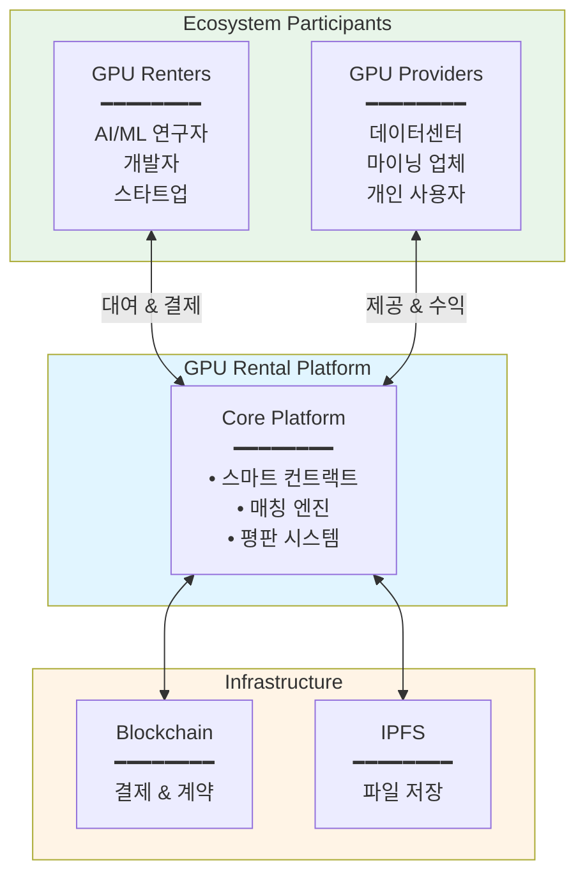
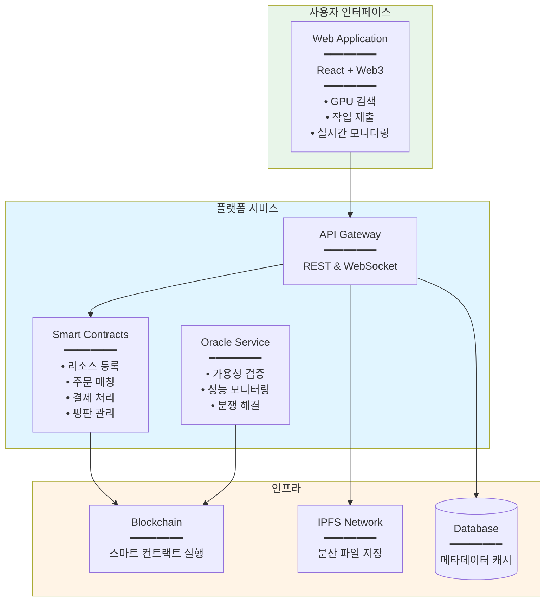
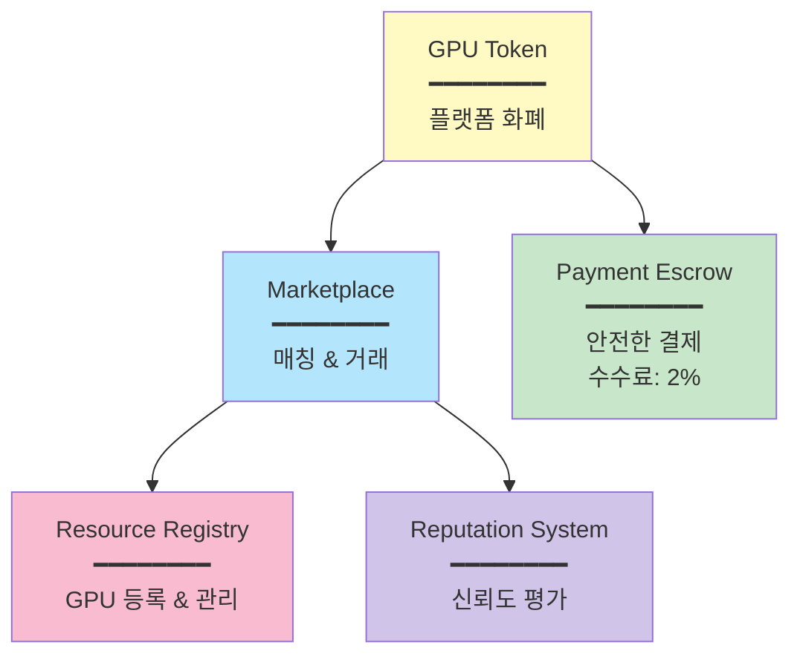
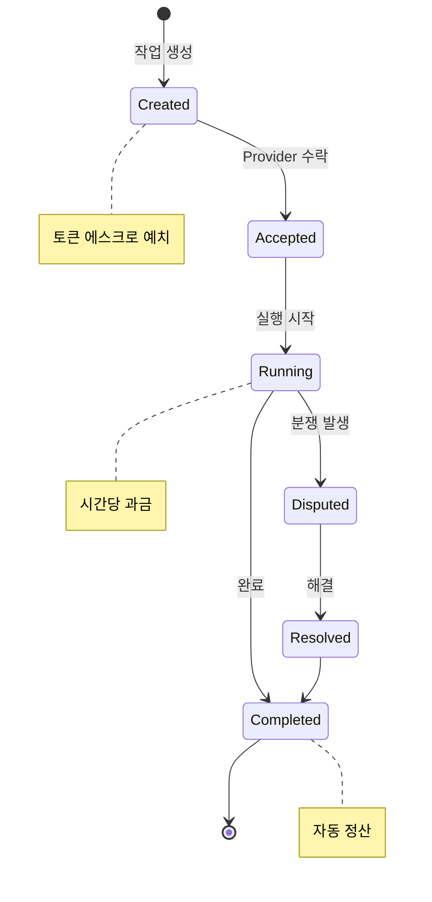
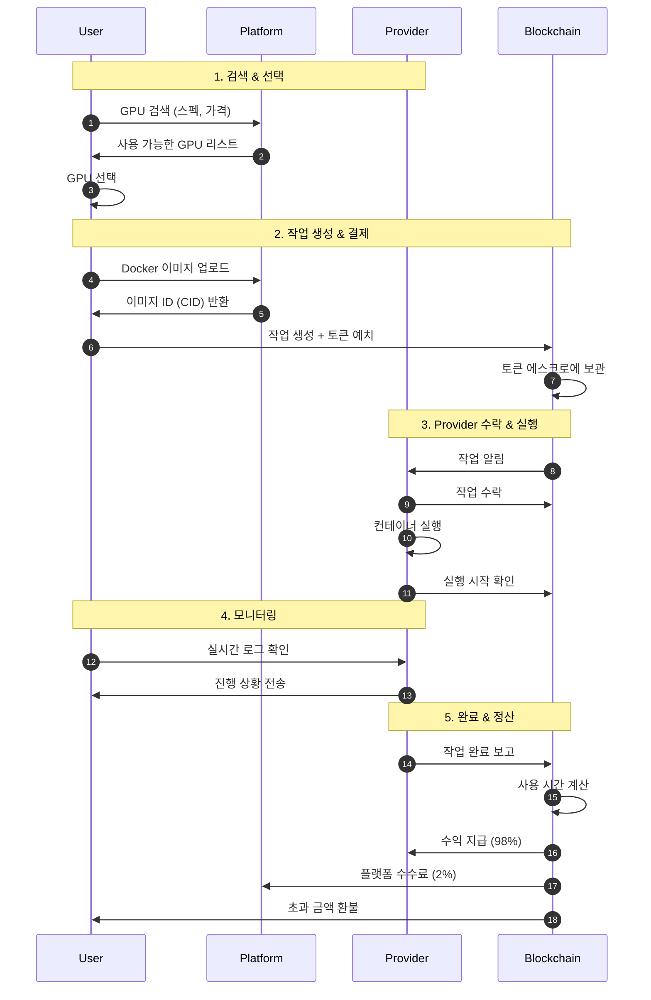
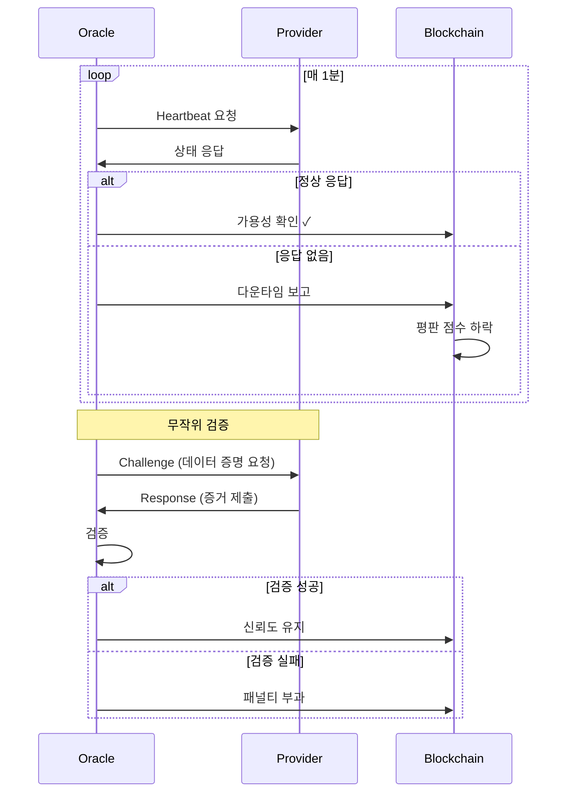
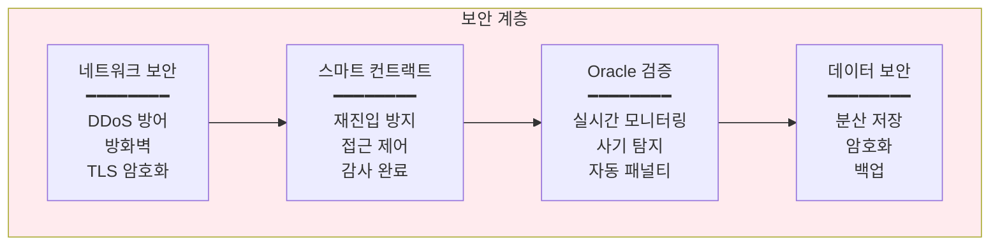
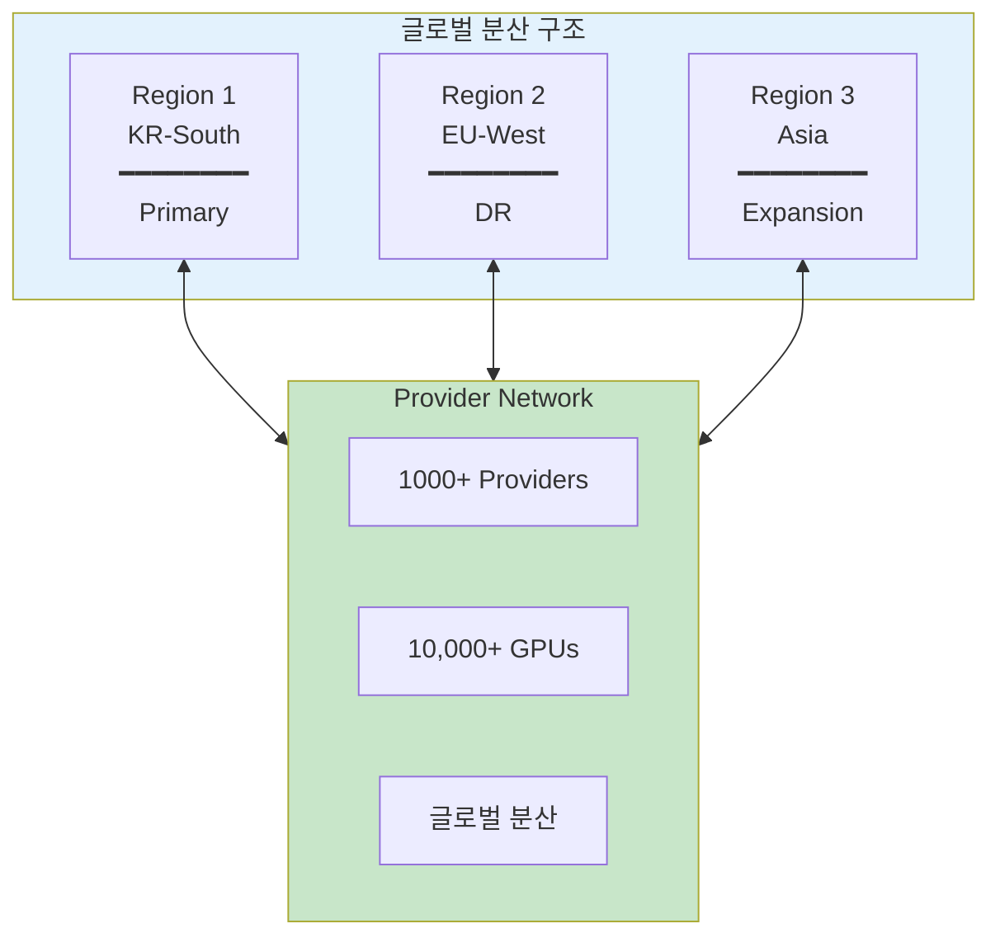
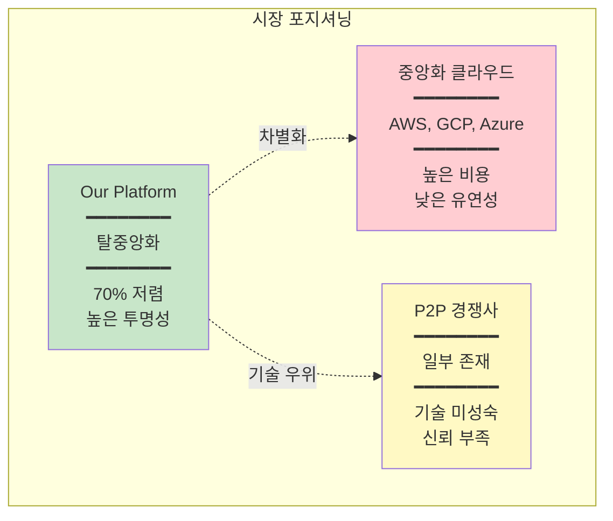
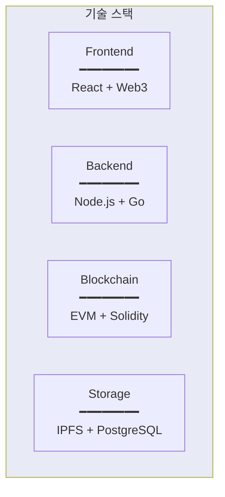

# GPU Rental Platform - Investment Deck

  

## Executive Summary

  

**블록체인 기반 탈중앙화 GPU 마켓플레이스**

  

유휴 GPU 리소스를 필요한 사람에게 연결하는 P2P 플랫폼으로, 중앙화된 중개자 없이 투명하고 효율적인 거래를 실현합니다.

  

### 핵심 가치 제안

  

- **투명성**: 스마트 컨트랙트 기반 자동화된 거래

- **효율성**: P2P 직거래로 중개 수수료 최소화 (2%)

- **확장성**: 글로벌 분산 네트워크

- **신뢰성**: 블록체인 기반 평판 시스템

  

### 시장 기회

  

- AI/ML 시장의 폭발적 성장 (연평균 40%+)

- GPU 수요 급증 vs 공급 부족

- 클라우드 GPU 비용 절감 니즈

---

  

# Platform Overview

  

## System Architecture

  



  

### 주요 참여자

  

**GPU Renters (수요)**

- AI/ML 모델 학습이 필요한 연구자

- 렌더링 작업이 필요한 크리에이터

- 추론 서비스를 운영하는 기업

  

**GPU Providers (공급)**

- 유휴 GPU를 보유한 데이터센터

- 채굴 중단 후 GPU 활용을 원하는 업체

- 고성능 PC 소유자

  

---

  

# Core Architecture

  

## Technical Stack

  



  

### 핵심 컴포넌트

  

**스마트 컨트랙트**

- 리소스 등록 및 관리

- 자동화된 매칭 및 결제

- 투명한 평판 시스템

- 분쟁 해결 메커니즘

  

**IPFS (분산 저장소)**

- Docker 이미지 저장

- P2P 파일 공유

- 중앙화된 서버 불필요

  

**Oracle (검증 시스템)**

- Provider 가용성 실시간 체크

- 성능 및 품질 보증

- 자동화된 분쟁 해결

  

---

  

# Business Logic

  

## Smart Contract Architecture

  



  

### 거래 흐름

  



  

---

  

# Key Processes

  

## User Journey: GPU 대여 프로세스

  



  

## Oracle의 신뢰 보증

  



  

---

  

# Platform Security

  

## 다층 보안 체계

  



  

### 주요 보안 기능

  

**스마트 컨트랙트 보안**

- 오픈소스 검증된 라이브러리 사용

- 업그레이드 가능한 프록시 패턴

  

**Oracle 기반 신뢰**

- 실시간 Provider 가용성 체크

- 무작위 데이터 검증

- 자동화된 분쟁 해결

  

**경제적 안전장치**

- Provider는 보증금(Stake) 예치 필수

- 사기 적발 시 보증금 몰수

- 평판 시스템으로 장기적 인센티브

  

---

  

# Scalability & Growth

  

## 확장 가능한 인프라

  



  

### 성장 전략

  

**네트워크 효과**

- Provider ↑ → 가격 ↓ → User ↑

- User ↑ → 수익 ↑ → Provider ↑

- 선순환 생태계

  

**기술적 확장성**

- 수평적 확장: 서버 추가로 무제한 성장

- IPFS: P2P로 자연스럽게 확장

  

---

  

# Business Model

  

## 수익 구조

**낮은 수수료 (2%)**

- 경쟁력 있는 가격 구조

  

**토큰 이코노미**

- 플랫폼 내 결제 수단

- Staking으로 보안 강화

- 거버넌스 참여 권한

**TAM (Total Addressable Market)**

- 글로벌 클라우드 GPU 시장: $40B+ (2025)

- 연평균 성장률: 40%+

- 2030년 예상 시장: $200B+

  

**Target Market**

- AI/ML 스타트업

- 개인 연구자

- 크리에이터

- 중소기업

  

## Competitive Advantages

1. **낮은 비용**: 중앙화 경쟁사 대비 70% 저렴

2. **투명성**: 블록체인 기반 신뢰

3. **확장성**: P2P 네트워크 효과

4. **유연성**: 시간 단위 과금, 즉시 사용

  

## Competitive Landscape

  



---

  

# Technology Stack

  




### 검증된 기술

  

- **Blockchain**: EVM 호환으로 광범위한 생태계 활용

- **IPFS**: 실전 검증된 분산 스토리지

- **Smart Contracts**: OpenZeppelin 보안 라이브러리

## 실제 활용 사례

  

**AI/ML 연구**

```

상황: 대학원생이 논문을 위한 모델 학습 필요

문제: AWS GPU 인스턴스 비용 부담 ($3/hour)

해결: 플랫폼에서 $1/hour에 대여

결과: 70% 비용 절감, 더 많은 실험 가능

```

  

**3D 렌더링**

```

상황: 프리랜서 크리에이터의 단기 렌더링 작업

문제: 고정 계약 없이 즉시 GPU 필요

해결: 분 단위 과금으로 4시간만 사용

결과: 유연한 비용 관리

```

  

**스타트업 추론 서비스**

```

상황: AI 스타트업의 추론 서비스 운영

문제: 트래픽 변동성 높음

해결: 자동 스케일링 가능한 GPU 풀

결과: 인프라 비용 최적화

```
  

## Appendix: Technical Details

  

### API Endpoints

```

GET    /api/v1/gpus              # GPU 리스트

POST   /api/v1/instances         # 작업 생성

GET    /api/v1/instances/:id     # 상태 확인

```

  

### Smart Contract Functions

```

registerResource()   # GPU 등록

createJob()         # 작업 생성

completeJob()       # 작업 완료

```

  

### 주요 용어

  

- **CID**: IPFS 파일 주소

- **Escrow**: 안전한 결제를 위한 예치금

- **Oracle**: 온체인-오프체인 연결 서비스

- **Stake**: 보증금

  
**Last Updated**: 2025-10-30  

**Version**: 1.0.0