# GPU Rental Platform - Investment Deck

## Executive Summary

**블록체인 기반 탈중앙화 GPU 마켓플레이스**

유휴 GPU 리소스를 필요한 사람에게 연결하는 P2P 플랫폼으로, 중앙화된 중개자 없이 투명하고 효율적인 거래를 실현합니다.

### 핵심 가치 제안

- **투명성**: 스마트 컨트랙트 기반 자동화된 거래
- **효율성**: P2P 직거래로 중개 수수료 최소화 (2%)
- **확장성**: 글로벌 분산 네트워크
- **신뢰성**: 블록체인 기반 평판 시스템

### 시장 기회

- AI/ML 시장의 폭발적 성장 (연평균 40%+)
- GPU 수요 급증 vs 공급 부족
- 클라우드 GPU 비용 절감 니즈 (최대 70% 저렴)

---

# Platform Overview

## System Architecture

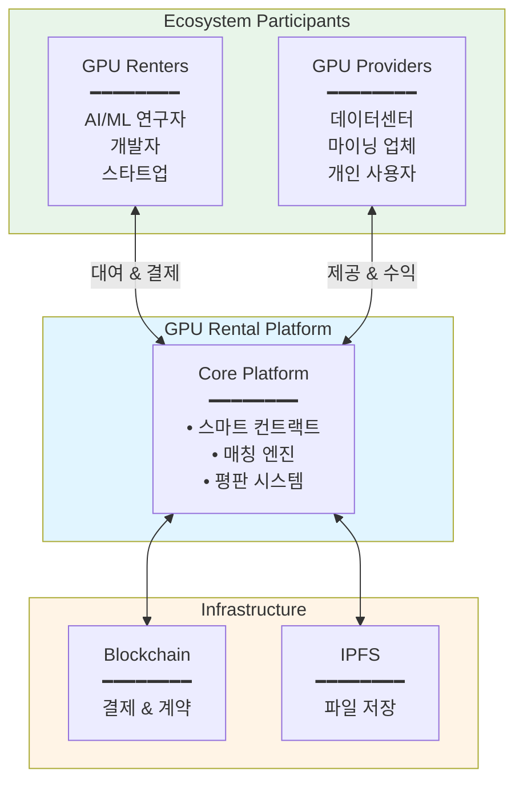

### 주요 참여자

**GPU Renters (수요)**

- AI/ML 모델 학습이 필요한 연구자
- 렌더링 작업이 필요한 크리에이터
- 추론 서비스를 운영하는 기업

**GPU Providers (공급)**

- 유휴 GPU를 보유한 데이터센터
- 채굴 중단 후 GPU 활용을 원하는 업체
- 고성능 PC 소유자

---

# Core Architecture

## Technical Stack

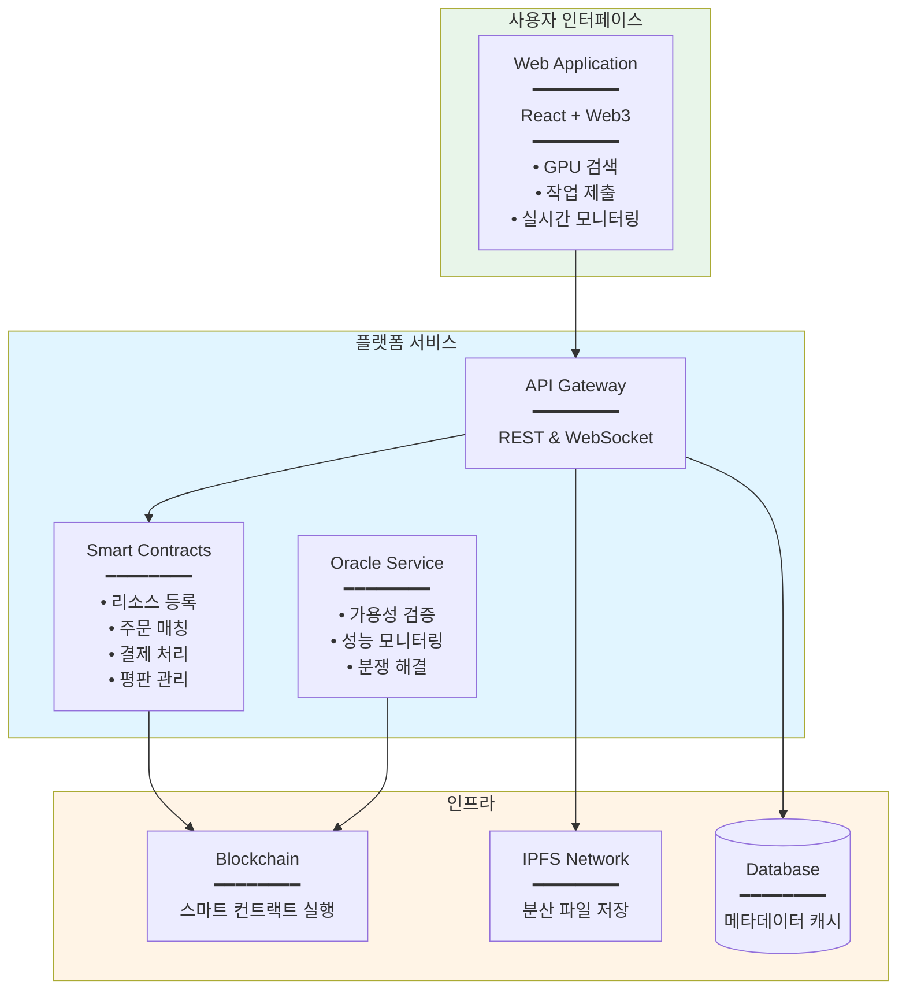

### 핵심 컴포넌트

**스마트 컨트랙트**

- 리소스 등록 및 관리
- 자동화된 매칭 및 결제
- 투명한 평판 시스템
- 분쟁 해결 메커니즘

**IPFS (분산 저장소)**

- Docker 이미지 저장
- P2P 파일 공유
- 중앙화된 서버 불필요

**Oracle (검증 시스템)**

- Provider 가용성 실시간 체크
- 성능 및 품질 보증
- 자동화된 분쟁 해결

---

# Business Logic

## Smart Contract Architecture

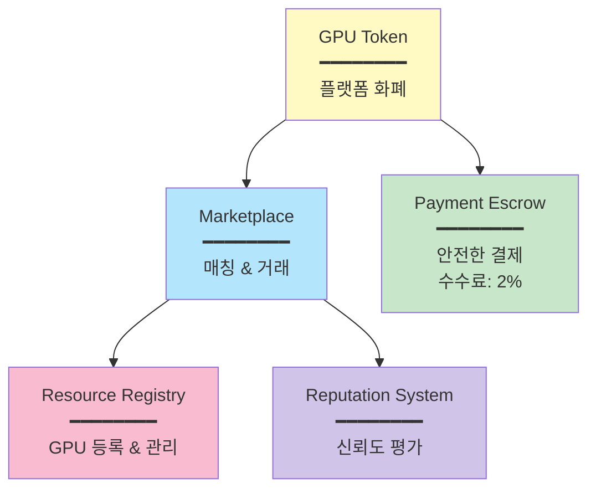

### 거래 흐름

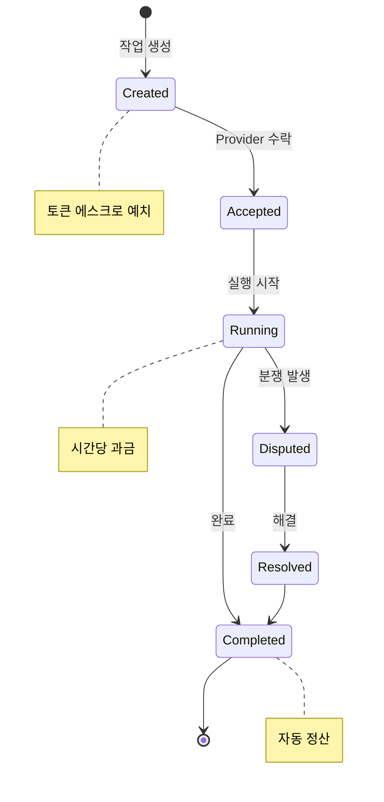

---

# Key Processes

## User Journey: GPU 대여 프로세스

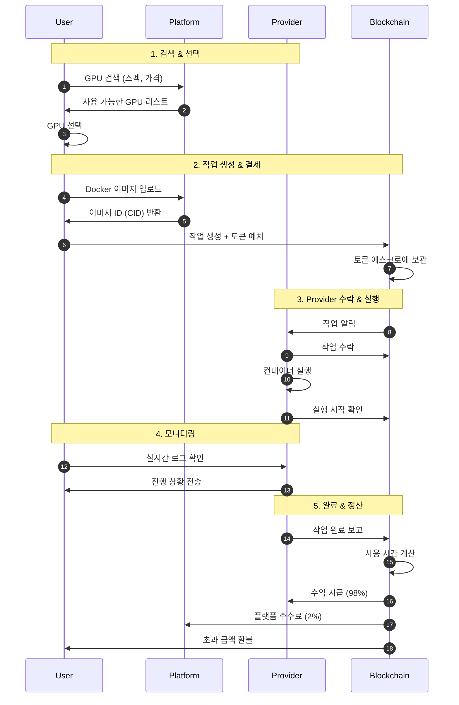

## Oracle의 신뢰 보증

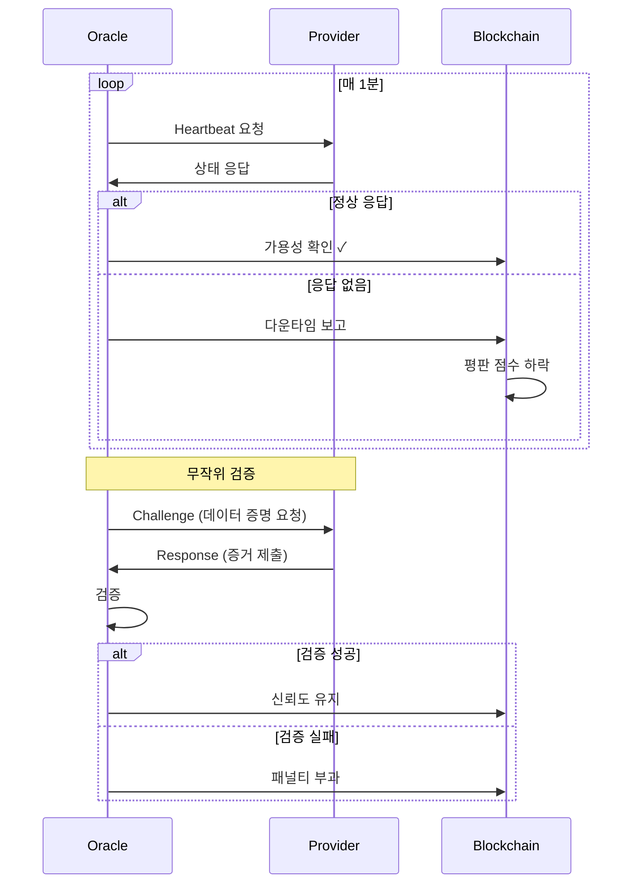

---

## 5.2 Defense in Depth

```mermaid
graph TB
    subgraph Layer1["Layer 1: Network Security"]
        L1A[DDoS Protection<br/>━━━━━━━━<br/>• Cloudflare<br/>• Rate Limiting<br/>• IP Filtering]
        
        L1B[Firewall<br/>━━━━━━━━<br/>• Ingress Rules<br/>• Egress Rules<br/>• Port Restrictions]
        
        L1C[VPC Isolation<br/>━━━━━━━━<br/>• Private Subnets<br/>• Network ACLs<br/>• Security Groups]
    end
    
    subgraph Layer2["Layer 2: Application Security"]
        L2A[Input Validation<br/>━━━━━━━━<br/>• Schema Validation<br/>• Sanitization<br/>• Type Checking]
        
        L2B[Authentication<br/>━━━━━━━━<br/>• Wallet Signature<br/>• JWT Tokens<br/>• Session Management]
        
        L2C[Authorization<br/>━━━━━━━━<br/>• Role-Based Access<br/>• Resource Ownership<br/>• Permission Checks]
    end
    
    subgraph Layer3["Layer 3: Smart Contract Security"]
        L3A[Access Control<br/>━━━━━━━━<br/>• Ownable<br/>• Roles<br/>• Modifiers]
        
        L3B[Safety Checks<br/>━━━━━━━━<br/>• ReentrancyGuard<br/>• Overflow Protection<br/>• State Validation]
        
        L3C[Upgradability<br/>━━━━━━━━<br/>• Proxy Pattern<br/>• Emergency Pause<br/>• Timelock]
    end
    
    subgraph Layer4["Layer 4: Container Security"]
        L4A[Isolation<br/>━━━━━━━━<br/>• Namespace<br/>• cgroups<br/>• Capabilities]
        
        L4B[Resource Limits<br/>━━━━━━━━<br/>• CPU Quota<br/>• Memory Limit<br/>• Disk I/O]
        
        L4C[Scanning<br/>━━━━━━━━<br/>• Vulnerability Scan<br/>• Malware Detection<br/>• Static Analysis]
    end
    
    subgraph Layer5["Layer 5: Data Security"]
        L5A[Encryption at Rest<br/>━━━━━━━━<br/>• Database Encryption<br/>• Disk Encryption<br/>• Key Management]
        
        L5B[Encryption in Transit<br/>━━━━━━━━<br/>• TLS 1.3<br/>• Certificate Pinning<br/>• Perfect Forward Secrecy]
        
        L5C[Access Logging<br/>━━━━━━━━<br/>• Audit Trails<br/>• Anomaly Detection<br/>• SIEM Integration]
    end
    
    Layer1 --> Layer2
    Layer2 --> Layer3
    Layer3 --> Layer4
    Layer4 --> Layer5
    
    style Layer1 fill:#e3f2fd
    style Layer2 fill:#f3e5f5
    style Layer3 fill:#fff9c4
    style Layer4 fill:#ffccbc
    style Layer5 fill:#c8e6c9
```

---

# Deployment Architecture

## 6.1 Infrastructure Layout

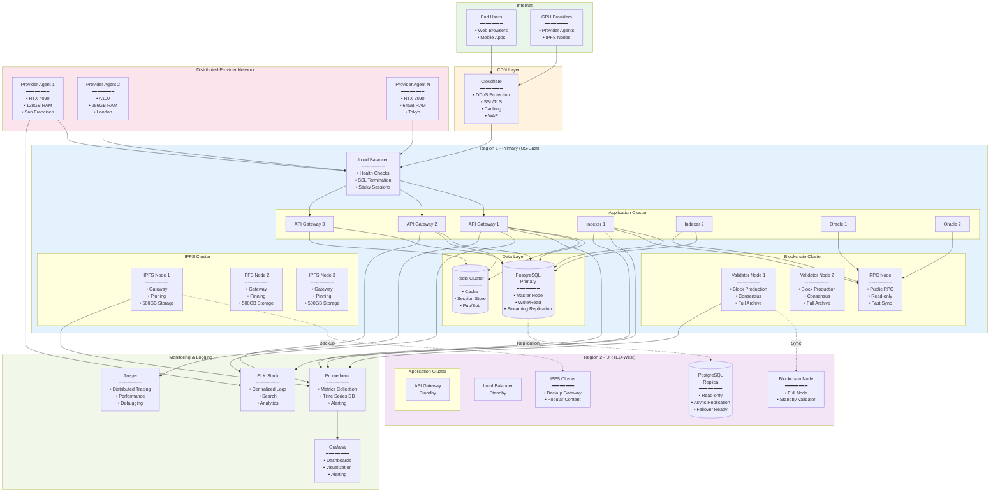

## 6.2 Scalability & High Availability

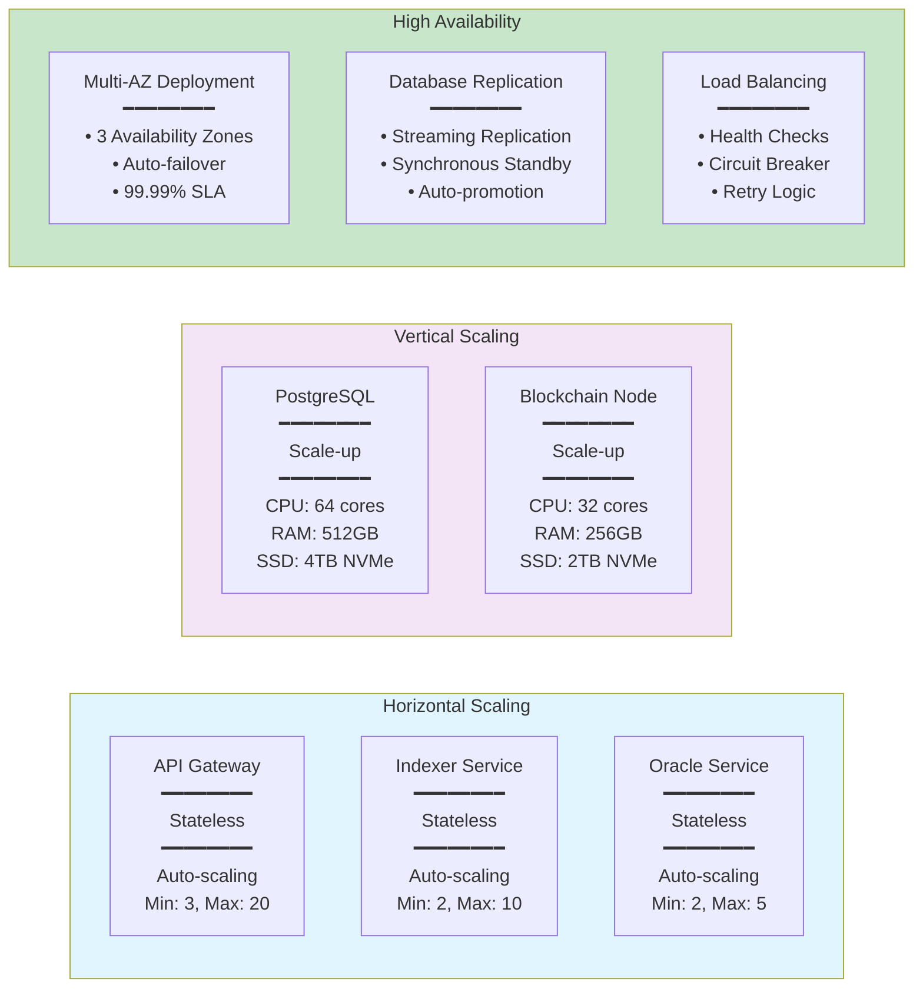

---

# Monitoring & Observability

## 7.1 Monitoring Stack

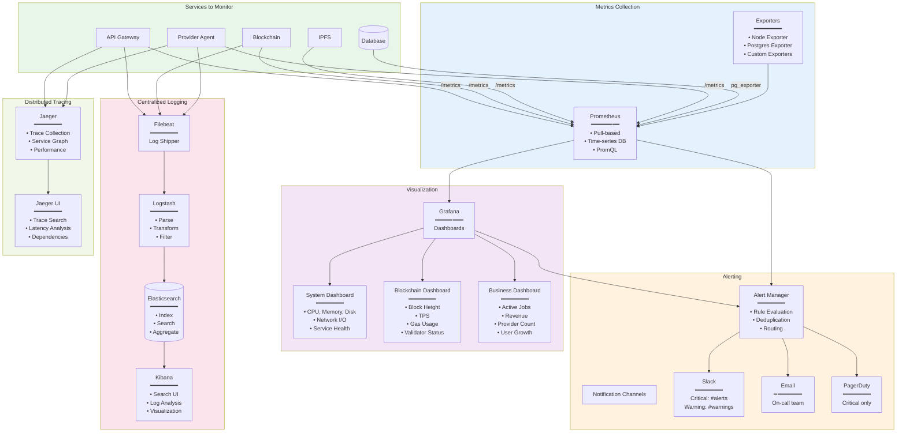

## 7.2 Key Metrics

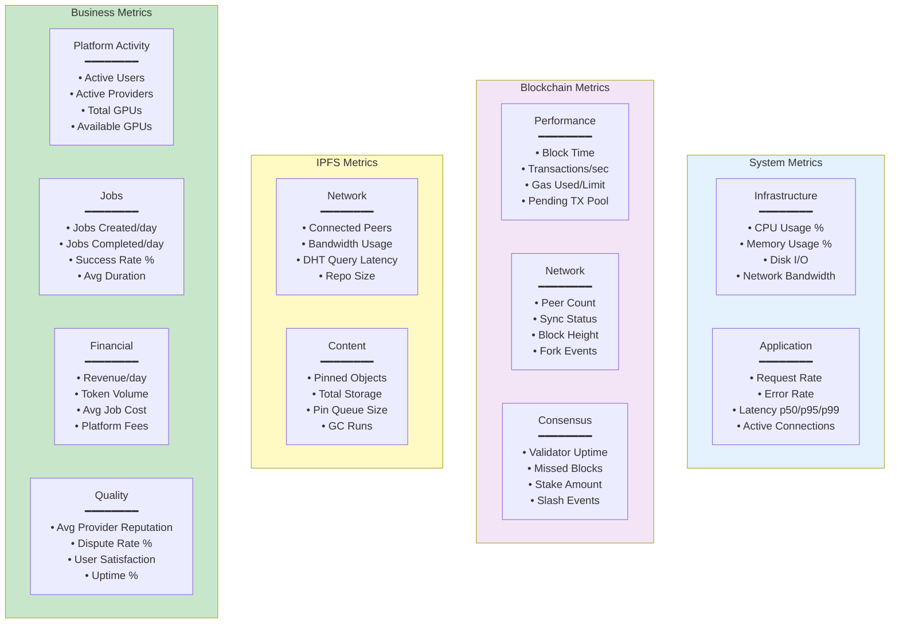

---

# Appendix

## A. Technology Stack Summary

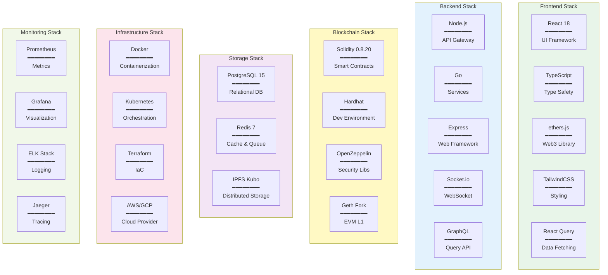

## B. API Reference Summary

### Blockchain APIs (Smart Contracts)

```
ResourceRegistry:
- registerResource(gpuModel, vcpu, memoryGB, storageGB, pricePerHour)
- updateAvailability(resourceId, available)
- updatePricing(resourceId, newPrice)
- getResource(resourceId)

Marketplace:
- createJob(resourceId, imageCID, estimatedDuration)
- acceptJob(jobId)
- startJob(jobId)
- completeJob(jobId)
- disputeJob(jobId, reason)

PaymentEscrow:
- lockFunds(jobId, amount, user, provider)
- releaseFunds(jobId, actualCost)
- refund(jobId, amount)
```

### REST APIs

```
GET    /api/v1/gpus
GET    /api/v1/gpus/:id
POST   /api/v1/instances
GET    /api/v1/instances/:id
DELETE /api/v1/instances/:id
GET    /api/v1/images
POST   /api/v1/images/upload
```

### GraphQL APIs

```graphql
query {
  gpus(filters: {...})
  jobs(user: "0x...")
  myJobs(address: "0x...")
}

subscription {
  jobStatusChanged(jobId: "0x...")
  newGPUAvailable
}
```

## C. Glossary

- **CID**: Content Identifier, IPFS의 파일 주소
- **DHT**: Distributed Hash Table, 분산 키-값 저장소
- **Escrow**: 제3자가 보관하는 예치금
- **Pinning**: IPFS에서 파일을 로컬에 유지
- **Reputation**: 제공자의 신뢰도 점수
- **Stake**: 참여를 위해 예치한 토큰
- **Oracle**: 온체인과 오프체인을 연결하는 서비스
- **EVM**: Ethereum Virtual Machine
- **PoS**: Proof of Stake, 지분 증명 합의 알고리즘
- **TPS**: Transactions Per Second
- **Gas**: 블록체인 거래 수수료

---

**Document End**

Last updated: 2025-10-30  
Version: 1.0.0